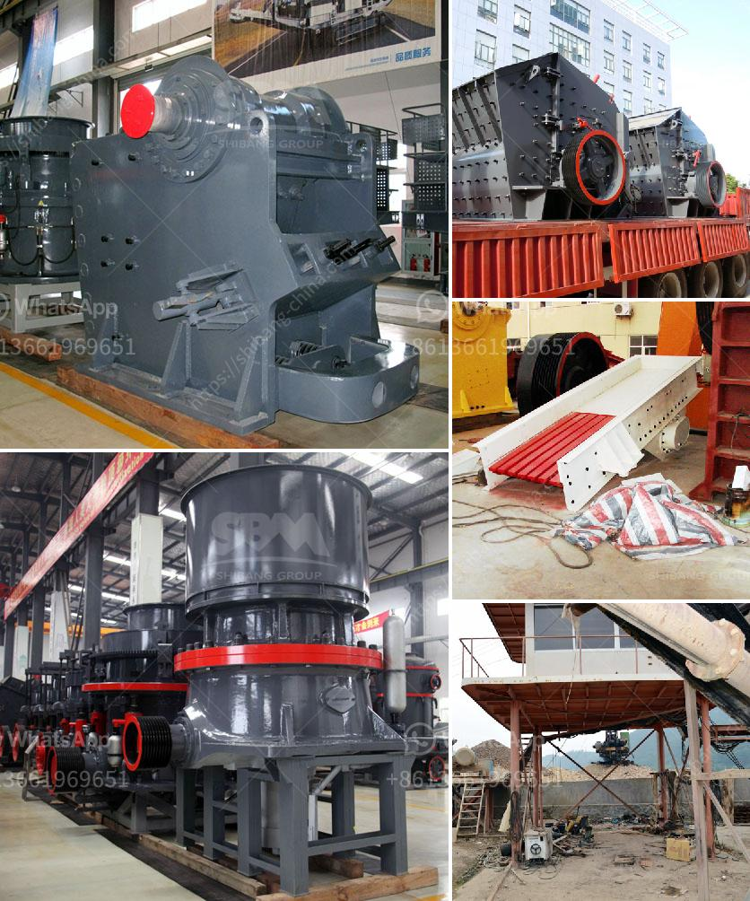

<h3>how to grind sand into powder</h3>
Sand is a commonly used material in various applications, from construction to manufacturing. However, sometimes you may need to grind sand into a finer powder for specific purposes. Whether you need sand powder for creating pottery or blending with other materials for a unique concoction, the grinding process is quite straightforward once you have the right tools and follow a systematic approach. In this article, we will guide you through the step-by-step process of how to grind sand into powder.

1. Sand: Gather the sand that you intend to grind into powder. Ensure that the sand is clean and free of other debris or contaminants that may affect your end result.

2. Mortar and Pestle: This traditional grinding tool is essential for turning sand into powder. It consists of a hard and deep bowl-like structure (the mortar) and a cylindrical pounding tool (the pestle).

Before proceeding with the grinding process, it's important to prepare the mortar and pestle properly. Clean both the mortar and pestle thoroughly to remove any dust or particles that might interfere with the grinding. Make sure they are dry before continuing.

Once the mortar and pestle are clean and dry, proceed by adding a small amount of sand to the mortar. The quantity will depend on your specific requirements. It's best to start with a small amount and gradually add more as needed.

With the sand in the mortar, firmly grip the pestle and start grinding the sand in a circular motion. Apply firm yet controlled pressure to crush the sand grains into a fine powder. The grinding motion should be rhythmic and consistent for the desired results.

Continue grinding the sand until you achieve the desired level of fineness. This may take some time and effort, depending on the sand's composition and your grinding technique. The finer you want the powder, the longer the grinding process may take.

Periodically stop grinding to check the consistency of the sand powder. Rub a small amount of the powder between your fingers to feel its texture. If it feels coarse or grainy, continue grinding. If it feels smooth and powdery, you have successfully ground the sand into a fine powder.

Once you achieve the desired consistency, carefully transfer the sand powder from the mortar to a clean and dry container for storage. Seal the container tightly to prevent moisture or other contaminants from affecting the quality of the powder.

Grinding sand into powder can be a simple yet rewarding process when done correctly. With the help of a mortar and pestle, you can transform sand into a fine powder suitable for various applications. Just remember to start with a small amount of sand and gradually add more if needed. Follow the grinding process consistently until the desired fineness is achieved, and then store the powder in an airtight container. Now that you know how to grind sand into powder, you can explore its versatile use in different creative projects or professional applications.
<h3>Contact us</h3><ul><li><strong>Whatsapp:&nbsp;<a href="https://wa.me/8613661969651">+8613661969651</a></strong></li><li><a href="https://swt.shibang-china.com/?git&amp;zhl&amp;how to grind sand into powder"><strong>Online Service(chat now)</strong></a></li></ul><h3>Related</h3><ul><li><a href='gold hammer mills for sale south africa.md'>gold hammer mills for sale south africa</a></li><li><a href='calcium ball mill.md'>calcium ball mill</a></li><li><a href='limestone crusher screening types plant.md'>limestone crusher screening types plant</a></li><li><a href='stone crusher machine supplier.md'>stone crusher machine supplier</a></li><li><a href='mobile chrome crusher suppliers in south africa.md'>mobile chrome crusher suppliers in south africa</a></li></ul>