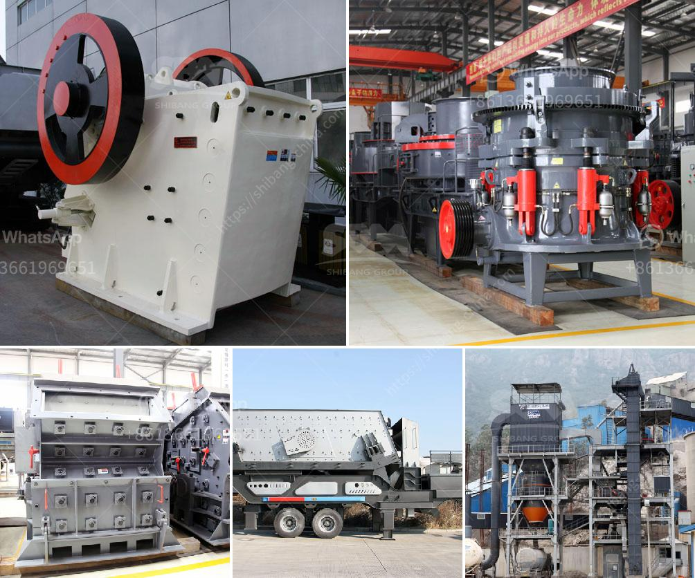

<h3>how to improve grinding efficiency of a mill</h3>
Grinding is a significant process in many industries such as the mining, cement, and mineral industries. It is an energy-intensive process that consumes a lot of electricity and resources, which can lead to high operational costs. Therefore, improving grinding efficiency is crucial to reduce costs and enhance productivity. In this article, we will discuss some effective ways to improve the grinding efficiency of a mill.

1. Select the right equipment: Choosing the correct grinding equipment is the first step to ensure efficient grinding. Different mills have different characteristics, and selecting the appropriate one for a specific application is essential. Factors to consider include the type of material to be ground, the desired particle size, and the throughput requirements.

2. Optimize mill charge: The grinding efficiency can be improved by optimizing the mill charge. When the mill is loaded with the right amount and type of grinding media, it performs optimally. Overloading or underloading the mill can negatively affect its efficiency. Therefore, it is crucial to determine the optimal filling level and size distribution of grinding media for each mill.

3. Control feed rate: The feed rate into the mill plays a vital role in achieving optimum grinding efficiency. Too high or too low feed rates can affect the mill's performance negatively. The feed rate should be carefully controlled to maintain a constant and suitable flow of material into the mill. It can be achieved through the use of feeders or by adjusting the speed of the feeding device.

4. Reduce particle size: Grinding efficiency can also be improved by reducing the particle size of the material being ground. Smaller particles have a larger surface area, which leads to better grinding action and faster material disintegration. Using finer grinding media or decreasing the gap between grinding media can help to achieve a smaller particle size.

5. Optimize mill speed: The speed at which the mill rotates also impacts its grinding efficiency. Increasing the mill speed can improve the movement of grinding media and enhance the grinding action. However, too high a mill speed can cause excessive wear and inefficient grinding. Therefore, finding the right balance is crucial to optimize the grinding process.

6. Maintain mill internals: Regular maintenance of mill internals is essential for ensuring proper grinding efficiency. Wear and tear of grinding media, liners, and other components can affect the mill's performance. Regular inspection and replacement of worn-out parts can help maintain optimal grinding conditions and improve efficiency.

7. Monitor and control grinding parameters: Monitoring and controlling various grinding parameters can significantly impact grinding efficiency. Parameters such as mill power consumption, grinding pressure, and temperature should be closely monitored and controlled to ensure efficient grinding. Advanced control systems and monitoring tools can assist in optimizing these parameters and improving grinding efficiency.

In conclusion, improving the grinding efficiency of a mill is essential for reducing costs and enhancing productivity. It can be achieved by selecting the right equipment, optimizing mill charge, controlling feed rate, reducing particle size, optimizing mill speed, maintaining mill internals, and monitoring and controlling grinding parameters. Implementing these measures can lead to significant improvements in grinding efficiency, resulting in cost savings and improved overall performance.
<h3>Contact us</h3><ul><li><strong>Whatsapp:&nbsp;<a href="https://wa.me/8613661969651">+8613661969651</a></strong></li><li><a href="https://swt.shibang-china.com/?git&amp;zhl&amp;how to improve grinding efficiency of a mill"><strong>Online Service(chat now)</strong></a></li></ul><h3>Related</h3><ul><li><a href='industrial vibrator feeder.md'>industrial vibrator feeder</a></li><li><a href='china vertical roller mill prices.md'>china vertical roller mill prices</a></li><li><a href='stone crusher fairs.md'>stone crusher fairs</a></li><li><a href='gravel and sand mining equipment.md'>gravel and sand mining equipment</a></li><li><a href='jaw impact crusher poland.md'>jaw impact crusher poland</a></li></ul>