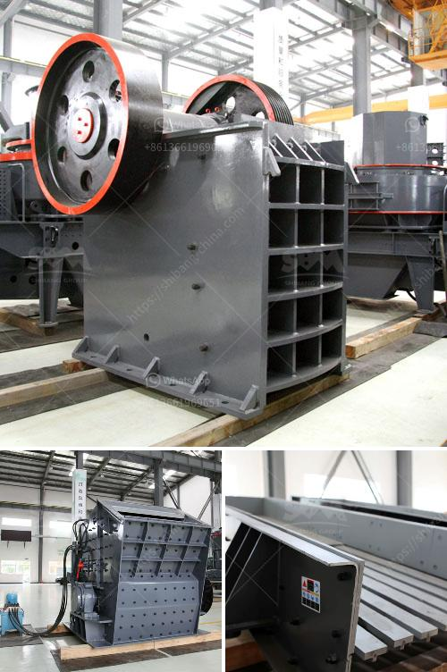

<h3>how to make a business plan for crusher plant</h3>
A crusher plant is a lucrative business venture in the construction industry. It requires a strong foundation in terms of financial resources, as well as strategic planning. A well-crafted business plan connects all the critical aspects of the business, from sourcing the raw materials to the establishment of a strong customer base. In this article, we will discuss how to make a business plan for a crusher plant, with a focus on the necessary steps and key considerations.

The first step in creating a business plan for a crusher plant is to research your potential customers. Identify the target market and their specific needs and preferences. This research will help you tailor your product/solution to meet their demands effectively.

To ensure the long-term viability of your crusher plant, it is crucial to assess the market competition. Study the existing players in your area and determine their strengths and weaknesses. This analysis will help you identify gaps in the market that you can capitalize on to gain a competitive advantage.

Your value proposition is a statement that outlines the unique value your crusher plant brings to customers. It highlights why customers should choose your products or services over those of your competitors. Define your value proposition by identifying key strengths and differentiators of your business.

Setting up a crusher plant requires a significant capital investment. You need to determine the total amount of funds needed to purchase equipment, hire staff, and cover other initial operational expenses. Make sure to have a realistic estimate of the required capital to avoid financial hiccups in the future.

A comprehensive marketing strategy is essential in growing your crusher plant business. Identify the most effective marketing channels to reach your target market, such as online advertising, social media platforms, and local construction industry events. Plan out your promotional activities, including advertising campaigns and networking initiatives, to raise awareness about your crusher plant.

Your operations plan outlines the day-to-day activities and processes involved in running your crusher plant. It includes details on sourcing raw materials, crushing processes, quality control measures, inventory management, and shipping logistics. Develop effective strategies for each step in the operations process to ensure smooth production and customer satisfaction.

The financial projections in your business plan provide an overview of the expected revenue, expenses, and profitability of your crusher plant. It helps you understand the financial viability of your venture and determine if you need additional financing. Include details such as projected sales, operating costs, break-even analysis, and cash flow projections over a specific period.

Lastly, define key performance indicators (KPIs) to track the progress and success of your crusher plant. KPIs can include metrics like production efficiency, customer satisfaction levels, revenue growth rate, and market share. Regularly monitor and analyze these KPIs to identify areas for improvement and make informed business decisions.

In conclusion, developing a comprehensive business plan for a crusher plant is crucial for its success. Conduct thorough market research, devise a sound marketing strategy, determine the required capital, create an operations plan, prepare financial projections, and establish key performance indicators. By following these steps, you will be well on your way to building a profitable and sustainable crusher plant business.
<h3>Contact us</h3><ul><li><strong>Whatsapp:&nbsp;<a href="https://wa.me/8613661969651">+8613661969651</a></strong></li><li><a href="https://swt.shibang-china.com/?git&amp;zhl&amp;how to make a business plan for crusher plant"><strong>Online Service(chat now)</strong></a></li></ul><h3>Related</h3><ul><li><a href='list of mini cement plants in gujarat.md'>list of mini cement plants in gujarat</a></li><li><a href='cement plant machinery manufacturers in germany.md'>cement plant machinery manufacturers in germany</a></li><li><a href='mineral industrial crusher.md'>mineral industrial crusher</a></li><li><a href='compact concrete crusher.md'>compact concrete crusher</a></li><li><a href='mobile stone crusher in saudi.md'>mobile stone crusher in saudi</a></li></ul>