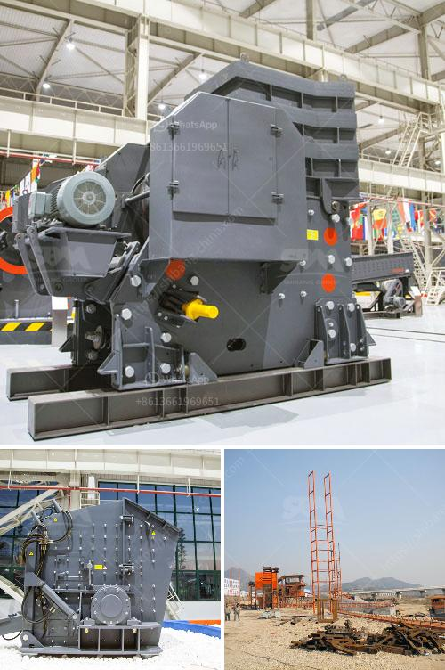

<h3>how to make a mineral crushing machine</h3>
A mineral crushing machine is a vital tool for industries involved in mining, drilling, and material processing applications. Crushing is a process that utilizes heavy-duty equipment to break rocks into smaller, more manageable fragments. In this article, we will discuss the steps to construct a reliable and efficient mineral crushing machine.

First and foremost, gather a team of experienced professionals who have a thorough understanding of mineral crushing operations. Begin by sketching the design and layout of the crushing machine, incorporating features that enhance performance, durability, and efficiency.

Choose high-strength materials capable of withstanding heavy loads, such as steel and cast iron, for constructing the mainframe and other critical components. Ensure that the chosen materials have excellent resistance to abrasion, corrosion, and impact to withstand the harsh mineral processing environment.

Assemble the designed components with precision and attention to detail. Utilize welding and machining techniques to attach different parts together, ensuring structural integrity and alignment. This step requires technical expertise and careful execution to ensure the machine functions effectively and safely.

Prioritize safety by integrating appropriate safety features into the machine's design. Consider features such as emergency stops, protective guards, and warning systems to prevent accidents and protect workers from potential hazards during the crushing process.

After completing the construction, conduct comprehensive troubleshooting and testing procedures to identify and rectify any potential defects or flaws. Thoroughly evaluate the machine's performance, its capability to handle various mineral types, and its overall efficiency.

Building a reliable mineral crushing machine requires careful planning, attention to detail, and expertise. By following the steps outlined above, one can design and construct an efficient machine that meets the specific crushing requirements of the mining industry. Remember to prioritize safety at every stage of the process to ensure the well-being of operators.
<h3>Contact us</h3><ul><li><strong>Whatsapp:&nbsp;<a href="https://wa.me/8613661969651">+8613661969651</a></strong></li><li><a href="https://swt.shibang-china.com/?git&amp;zhl&amp;how to make a mineral crushing machine"><strong>Online Service(chat now)</strong></a></li></ul><h3>Related</h3><ul><li><a href='raymod 5 roller mill for pulverizing unit.md'>raymod 5 roller mill for pulverizing unit</a></li><li><a href='grinding size of limestone.md'>grinding size of limestone</a></li><li><a href='mobile screening plant.md'>mobile screening plant</a></li><li><a href='raymond grinding mill machine.md'>raymond grinding mill machine</a></li><li><a href='mobile crushers for sale ghana.md'>mobile crushers for sale ghana</a></li></ul>