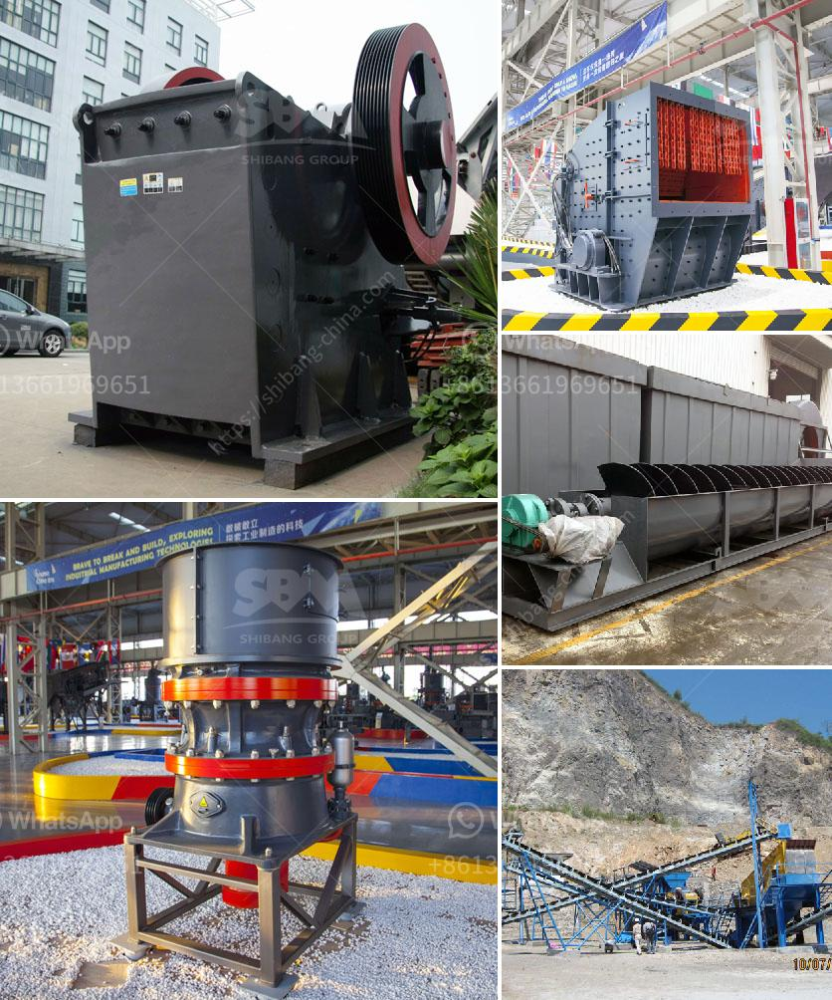

<h3>how to make a stone crusher mining</h3>
A stone crusher, also known as rock crusher, is a powerful machine used to grind large rocks into smaller pieces or gravel. It is a useful tool in the construction industry, mining industry, and agricultural industry. The weight of the stones can vary from a few grams to several tons; thus, before using a stone crusher, you need to ensure the suitability of the machine for your intended use. 

To make a stone crusher, you will need a few materials. These include iron sheets, beams, or cast iron pipes for the frame of the crusher. Also, you will need a heavy-duty base to support the components of the machine. Moreover, you will need pulleys, belts, and drives to transfer the power from a motor to the shaft of the crusher. 

To begin the construction of the stone crusher, start by welding the frame to the base. Ensure the frame is square and stable. Attach the iron sheets or beams to complete the basic structure. Then, using a welding machine or bolts, attach pulleys and belts to the shaft of the crusher. The pulleys and belts will enable the power transmission from the motor to the crusher.

Next, attach the motor to the frame of the crusher using bolts. Make sure the motor is the correct size for the crusher you are building. Connect the motor power cables to the electrical system of the crusher.

Once all the components are securely attached, test the crusher to ensure it is working properly. Place large rocks into the crushing chamber and turn on the motor. The rocks should be crushed into smaller pieces or gravel. If the machine is not crushing the rocks effectively, check the connections, pulleys, and belts to ensure everything is functioning properly.

In conclusion, constructing a stone crusher requires some technical skills and materials. However, it is possible to build your own stone crusher using iron sheets, beams, cast iron pipes, pulleys, belts, and a motor. This machine can be useful in mining, construction, and agriculture. Take appropriate safety precautions when building and operating a stone crusher to prevent accidents or injuries.
<h3>Contact us</h3><ul><li><strong>Whatsapp:&nbsp;<a href="https://wa.me/8613661969651">+8613661969651</a></strong></li><li><a href="https://swt.shibang-china.com/?git&amp;zhl&amp;how to make a stone crusher mining"><strong>Online Service(chat now)</strong></a></li></ul><h3>Related</h3><ul><li><a href='cost of an copper ore crusher.md'>cost of an copper ore crusher</a></li><li><a href='how to make a mineral crushing machine.md'>how to make a mineral crushing machine</a></li><li><a href='hammer pulverizer machine.md'>hammer pulverizer machine</a></li><li><a href='production process of cement.md'>production process of cement</a></li><li><a href='mobile crusher parker 50th crusher for sale.md'>mobile crusher parker 50th crusher for sale</a></li></ul>