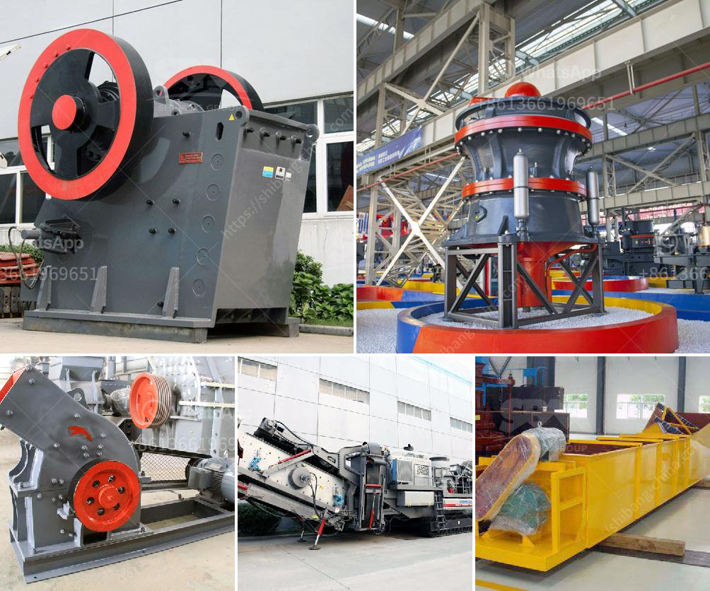

<h3>how to make clay powder machine</h3>
Clay powder machines are essential tools for potters and sculptors, enabling them to effortlessly transform dull clay blocks into fine, workable powder. While commercial clay powder machines are readily available, constructing your own at home can be a satisfying and cost-effective alternative. In this article, we will guide you through the step-by-step process of making a clay powder machine from scratch.

Begin by designing the clay powder machine. The main components include the motor, pulley, belt, frame, bearings, shafts, and clay container. Sketch your machine's dimensions and specifications, ensuring it suits your specific needs and available materials. The design should also consider safety measures such as protective guards for the gears and belts.

Construct the frame using sturdy metal or wooden bars according to your design. This will serve as the base and support for the other components. Attach the metal rods or pipes vertically on top of the frame, ensuring they align with the dimensions specified in your design. These bars will hold the clay container, allowing the clay to be fed into the machine.

Place the electric motor on the frame base securely. Ensure that it is positioned accurately and securely fastened to avoid any vibrations or wobbling during operation. Attach the pulley to the motor shaft using a key or screws, allowing the motor to transfer rotational power to the clay container.

Install the bearings and shafts on the frame, aligning them with the vertical bars on top. These will enable smooth rotation of the clay container during the powdering process. Make sure the bearings are securely attached and properly aligned to avoid any unnecessary friction.

Attach the clay container or hopper to the vertical bars, ensuring it is appropriately positioned above the grinding area. This will allow the clay to flow freely into the machine and be pulverized efficiently. Make sure the container is securely fastened and easy to remove for refilling.

By following these steps, you can create your own clay powder machine, eliminating the need to invest in expensive commercial alternatives. Remember to prioritize safety during the construction and operation of your machine. With your homemade clay powder machine, you can easily transform clay blocks into a fine, workable powder for various artistic and practical applications.
<h3>Contact us</h3><ul><li><strong>Whatsapp:&nbsp;<a href="https://wa.me/8613661969651">+8613661969651</a></strong></li><li><a href="https://swt.shibang-china.com/?git&amp;zhl&amp;how to make clay powder machine"><strong>Online Service(chat now)</strong></a></li></ul><h3>Related</h3><ul><li><a href='grinding of calcined gypsum.md'>grinding of calcined gypsum</a></li><li><a href='bauxite ore processing plant for sale.md'>bauxite ore processing plant for sale</a></li><li><a href='manganese processing plant in south africa.md'>manganese processing plant in south africa</a></li><li><a href='used industrial stone crushers for sale.md'>used industrial stone crushers for sale</a></li><li><a href='gypsum plant equipment catalogue.md'>gypsum plant equipment catalogue</a></li></ul>