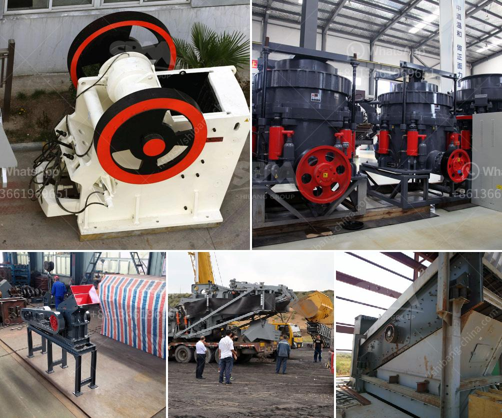

<h3>how to make limestone powder</h3>
Limestone powder is a versatile material that has numerous applications in various industries. Its widespread use is due to its ability to enhance the durability and strength of products while also contributing to their aesthetic appeal. Whether you need limestone powder for construction, agriculture, or manufacturing processes, the following steps will guide you on how to make it.

1. Source high-quality limestone: Start by obtaining limestone rocks from a reliable source. These rocks should be free of impurities, as they can affect the quality of the resulting powder. Limestone can be acquired from quarries or mines, ensuring it meets the required specifications.

2. Crushing and grinding: The next step involves crushing the limestone rocks into smaller fragments. Various crushing equipment, such as jaw crushers or impact crushers, can be used for this purpose. Once the rocks are crushed, they are further ground into finer particles using grinding mills, ball mills, or vertical roller mills.

3. Sifting and screening: After grinding, the limestone powder needs to be sieved or screened to remove any large particles or impurities. This ensures the powder has a uniform particle size and consistency, which is crucial for its diverse applications.

4. Calcination: In certain cases, it may be necessary to calcine the limestone powder. Calcination involves heating the powder at high temperatures to remove any residual moisture and convert the calcium carbonate present in limestone into calcium oxide or quicklime. This process enhances the chemical properties of the powder, making it suitable for specific applications.

5. Packaging and storage: Once the limestone powder is produced, it needs to be packaged and stored correctly. Use suitable packaging materials that can protect the powder from moisture or other contaminants. Always store the powder in a dry and cool place, away from direct sunlight, to maintain its quality for extended periods.

By following these steps, you can produce high-quality limestone powder that is suitable for various applications. Ensure you comply with safety regulations throughout the process and invest in proper equipment to achieve the desired particle size and consistency.
<h3>Contact us</h3><ul><li><strong>Whatsapp:&nbsp;<a href="https://wa.me/8613661969651">+8613661969651</a></strong></li><li><a href="https://swt.shibang-china.com/?git&amp;zhl&amp;how to make limestone powder"><strong>Online Service(chat now)</strong></a></li></ul><h3>Related</h3><ul><li><a href='potential of mica wet grinding plant.md'>potential of mica wet grinding plant</a></li><li><a href='quartz powder plant nigeria.md'>quartz powder plant nigeria</a></li><li><a href='caco grinding grinder.md'>caco grinding grinder</a></li><li><a href='vertical impact crusher manufacturer in india.md'>vertical impact crusher manufacturer in india</a></li><li><a href='screen clay from limestone rock.md'>screen clay from limestone rock</a></li></ul>