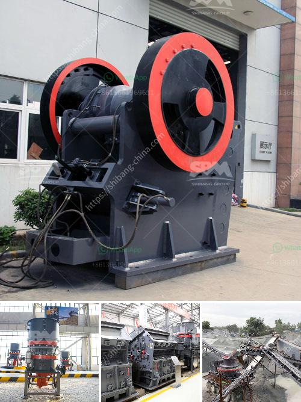

<h3>how to measure output of a crusher plant</h3>
Crusher plants are designed for high production and efficiency in the mining, quarrying, and construction industries. In this article, we will discuss how to measure the output of a crusher plant in terms of 300-500 tph (tons per hour).

The production capacity of a crusher plant is influenced by several factors, including the type and hardness of the material, the feed size, the required final product size, and the setting or configuration of the plant. Each of these factors can have a significant impact on the productivity and output of the crusher plant.

The type of material being crushed plays a crucial role in determining the output capacity of a crusher plant. Different materials have different hardness levels, which affect the crushing process. Harder materials require more energy and time for crushing, thereby reducing the overall output. It is important to analyze the characteristics of the material to ensure optimal plant performance.

The size of the feed material also affects the output capacity of the crusher plant. Smaller feed sizes tend to result in higher production rates, as the material is easier to crush and requires less energy. Conversely, larger feed sizes may result in reduced output capacity and even blockages within the crusher.

The desired final product size also impacts the output capacity of the crusher plant. Smaller final product sizes generally require more crushing stages and thus may reduce the overall output capacity. On the other hand, larger final product sizes may result in lower production rates, as they require less crushing stages.

The plant configuration and settings play a vital role in determining the output capacity. The crusher plant should be set up to achieve the desired output capacity and product size. This involves adjusting the crusher settings, including the crusher speed and the gap between the crushing surfaces. It is important to optimize these settings to maximize the production capacity of the plant.

The feed rate to the crusher plant is a crucial parameter for measuring the output capacity. It is important to maintain a consistent and controlled feed rate to the crusher to ensure optimal plant performance. A higher feed rate generally results in higher production rates, while a lower feed rate may reduce the overall output capacity.

Monitoring the power consumption of the crusher plant can provide valuable insights into its output capacity. Higher power consumption may indicate that the crusher is working harder to process the material, potentially leading to reduced output capacity. Lower power consumption, on the other hand, may suggest underutilization of the plant's capacity.

Regularly analyzing the production rates of the crusher plant can help identify any trends or variations in output capacity. Monitoring the amount of material processed per hour or per day can provide an indication of the plant's productivity. Higher production rates indicate better output capacity, while lower rates may require adjustments to the plant configuration.

In conclusion, measuring the output capacity of a crusher plant requires considering various factors such as material type, feed size, required final product size, and plant configuration. By closely monitoring the feed rate, power consumption, and production rates, operators can effectively assess the productivity and output capacity of a crusher plant.
<h3>Contact us</h3><ul><li><strong>Whatsapp:&nbsp;<a href="https://wa.me/8613661969651">+8613661969651</a></strong></li><li><a href="https://swt.shibang-china.com/?git&amp;zhl&amp;how to measure output of a crusher plant"><strong>Online Service(chat now)</strong></a></li></ul><h3>Related</h3><ul><li><a href='business plan for stone grinding in ethiopia.md'>business plan for stone grinding in ethiopia</a></li><li><a href='raymond grinding mill for sale in thailand.md'>raymond grinding mill for sale in thailand</a></li><li><a href='barite production lines manufacturers.md'>barite production lines manufacturers</a></li><li><a href='crusher plant in kenya.md'>crusher plant in kenya</a></li><li><a href='rock grinding mill price in india.md'>rock grinding mill price in india</a></li></ul>