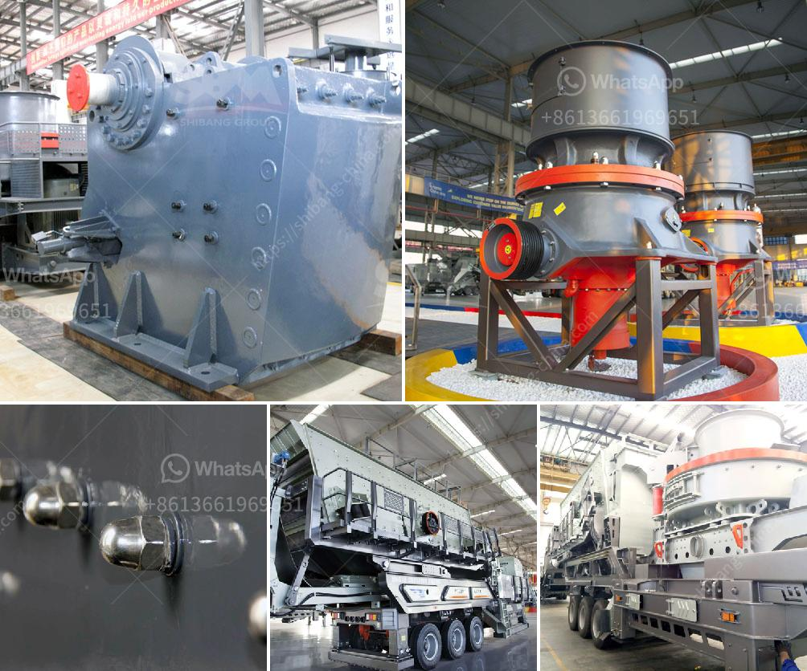

<h3>how to start a coal mine</h3>
Starting a coal mine requires meticulous planning, comprehensive research, and adherence to strict regulatory guidelines. As one of the most significant contributors to global energy production, coal mining offers numerous opportunities for growth and development. This article presents a concise guide on how to initiate a coal mine to help potential investors understand the essential steps involved.

Before venturing into coal mining, conducting a comprehensive feasibility study is crucial for assessing the economic viability of the project. Evaluate factors such as coal reserves, market demand, geology, and transportation logistics. Engaging experienced professionals and experts specialized in geology and mining can greatly facilitate this initial stage.

For legal compliance, secure the necessary licenses and permits required by local, regional, and national authorities. Consult with government agencies and mining associations to understand the regulatory framework involved. Adhering to safety and environmental standards is paramount to ensure sustainable mining practices.

Developing a robust business plan is essential for attracting potential investors and securing financing. Include a clear outline of ongoing expenses, projected revenues, and anticipated yield rates. Consider factors such as labor costs, equipment expenses, and market fluctuations to ensure an accurate financial forecast.

Identify suitable land for mining operations and secure the rights through leasing or purchasing agreements. Simultaneously, procure the required machinery and equipment for exploration, extraction, and transportation. Collaborate with suppliers and experts in the field to ensure you acquire reliable and efficient equipment.

Developing adequate infrastructure, including roads, power supply, and water management, is essential for efficient coal extraction and transportation. Implement safety measures to ensure the health and well-being of workers. Prioritize education and training programs to enhance safety awareness and improve operational efficiency.

Assemble a skilled workforce capable of handling various mining tasks. Seek professionals with industry experience and expertise. Prioritize providing comprehensive training programs to ensure workers are well-equipped to manage the complexities and risks of coal mining.

Starting a coal mine necessitates meticulous planning and adherence to various regulations. A comprehensive feasibility study, obtaining licenses, creating a detailed business plan, acquiring land and equipment, establishing infrastructure, and recruiting a competent workforce are all crucial steps. Successful coal mine operations require a dedicated focus on safety, adhering to environmental standards, and ensuring sustainable practices. By following these steps, potential investors can pave the way towards a prosperous and responsible coal mining venture.
<h3>Contact us</h3><ul><li><strong>Whatsapp:&nbsp;<a href="https://wa.me/8613661969651">+8613661969651</a></strong></li><li><a href="https://swt.shibang-china.com/?git&amp;zhl&amp;how to start a coal mine"><strong>Online Service(chat now)</strong></a></li></ul><h3>Related</h3><ul><li><a href='companies manufacturing quarry plant in uk.md'>companies manufacturing quarry plant in uk</a></li><li><a href='conveyor belt manufacturers in pakistan.md'>conveyor belt manufacturers in pakistan</a></li><li><a href='crusher sand washing machines for crusher nepal.md'>crusher sand washing machines for crusher nepal</a></li><li><a href='cement process making in philippines.md'>cement process making in philippines</a></li><li><a href='barite mining crusher in nigeria.md'>barite mining crusher in nigeria</a></li></ul>