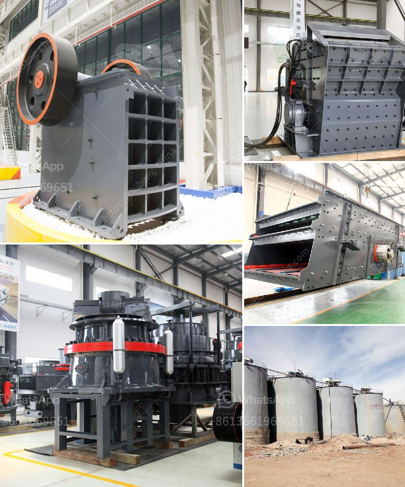

<h3>how to start a stone crushing business in nigeria</h3>
Starting a stone crushing business in Nigeria is not as difficult as it seems. All you need is a basic knowledge of machinery and equipment and a budget to start. As a beginner, it is essential to take entrepreneurial lessons before opening your doors. This will help you understand the industry and give you the necessary skills for success.

The first step is to find a suitable location for your quarry. It must be far away from residential areas and close to major roadways. Once you have secured a site, you need to obtain the necessary licenses and permits from the government agencies responsible for mining and quarrying. This may include environmental clearance, mining lease, and explosives license, among others.

After obtaining the required licenses, you should conduct a feasibility study to determine if your business idea is viable. This study will analyze the market demand, competition, and financial projections to guide your decision-making. It will also help you secure funding from banks or investors, as they will require a well-researched business plan.

Next, you need to acquire the necessary machinery and equipment for stone crushing. This includes crushers, conveyors, loaders, and screens. These machines are essential for breaking large stones into smaller sizes, which are then used in construction projects. You can either purchase new or used equipment, depending on your budget.

Hiring skilled and experienced staff is crucial for the smooth operation of your business. You will need operators, mechanics, drivers, and administrative staff. It is important to provide on-the-job training and safety precautions to prevent accidents and ensure efficiency.

Marketing and promoting your stone crushing business is crucial to attract customers. You can create a website, use social media platforms, and advertise in local newspapers and construction magazines. Networking with contractors, builders, and suppliers in the construction industry will also help you get more clients.

Another aspect to consider is the supply of raw materials. You need to establish reliable suppliers for stones, such as granite, limestone, or gravel, to ensure a constant supply for your crushing operations. Negotiating favorable pricing and payment terms is important to maintain profitability.

As your business grows, consider expanding your services. You can offer additional services, such as stone fabrication, which involves cutting and shaping stones for specific purposes. This will help diversify your revenue streams and attract a wider customer base.

Lastly, always prioritize safety and environmental regulations. Stone crushing is a potentially dangerous activity, so ensure all safety procedures and guidelines are followed. Implement measures to minimize dust and noise pollution, as well as secure the site to prevent accidents or unauthorized access.

In conclusion, starting a stone crushing business in Nigeria can be a profitable venture if you have the necessary skills, knowledge, and capital. Conduct thorough research, plan well, and seek professional advice, if needed, to ensure a smooth start. By providing quality products and services, marketing effectively, and adhering to safety regulations, you can build a successful stone crushing business.
<h3>Contact us</h3><ul><li><strong>Whatsapp:&nbsp;<a href="https://wa.me/8613661969651">+8613661969651</a></strong></li><li><a href="https://swt.shibang-china.com/?git&amp;zhl&amp;how to start a stone crushing business in nigeria"><strong>Online Service(chat now)</strong></a></li></ul><h3>Related</h3><ul><li><a href='mill for grinding quartz.md'>mill for grinding quartz</a></li><li><a href='stone crusher machine dealer in uae.md'>stone crusher machine dealer in uae</a></li><li><a href='mining mining processing.md'>mining mining processing</a></li><li><a href='ballast crusher line.md'>ballast crusher line</a></li><li><a href='raymond mills india.md'>raymond mills india</a></li></ul>