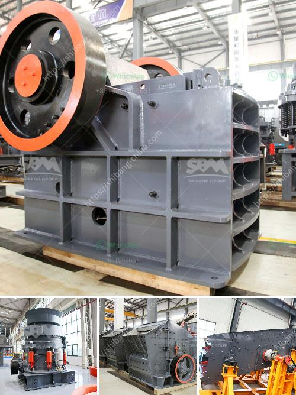

<h3>how to start a stone quarry business</h3>
Starting a stone quarry business is not a child's play as it requires a lot of strategic planning and execution. To ensure the success of your business, you need to ensure that your business plan is comprehensive and follows all the required guidelines. Starting a stone quarry business can be an overwhelming task, but it does not have to be. With the right guidance and support, it is possible to embark on this exciting journey with confidence.

First and foremost, it is important to establish and confirm the availability of stone deposits in the location where you intend to start your quarry. This can be done through extensive research and exploration, or by consulting with geologists or mining experts. Once you have identified a viable deposit, you will need to acquire the necessary permits and licenses to commence operations.

Next, you will need to secure funding for your business. This can be done through personal savings, loans, or by attracting investors. A solid business plan and financial projections will go a long way in convincing potential lenders or investors of the viability and profitability of your venture.

Once you have secured funding, it is time to set up the infrastructure required for your quarry business. This includes acquiring or leasing the necessary equipment, such as crushers, trucks, and loaders. Additionally, you will need to establish relationships with suppliers and contractors for the efficient operation of your quarry.

Marketing and promoting your stone quarry business is also crucial. This can be done through various channels, such as creating a website, leveraging social media platforms, attending trade shows, and networking with industry professionals. Developing a strong brand and establishing a reputation for delivering high-quality stone products will help attract customers and generate sales.

Starting a stone quarry business requires a great deal of effort, dedication, and hard work. However, the rewards can be substantial. If you are willing to put in the necessary time and effort, starting a stone quarry business can be a profitable venture that provides substantial income and long-term stability.
<h3>Contact us</h3><ul><li><strong>Whatsapp:&nbsp;<a href="https://wa.me/8613661969651">+8613661969651</a></strong></li><li><a href="https://swt.shibang-china.com/?git&amp;zhl&amp;how to start a stone quarry business"><strong>Online Service(chat now)</strong></a></li></ul><h3>Related</h3><ul><li><a href='used 34 ssi shredder united states.md'>used 34 ssi shredder united states</a></li><li><a href='complete crushing plant solutions prices.md'>complete crushing plant solutions prices</a></li><li><a href='sand maker machines.md'>sand maker machines</a></li><li><a href='gold mining crusher machinery.md'>gold mining crusher machinery</a></li><li><a href='vertical roller mill for cement german.md'>vertical roller mill for cement german</a></li></ul>