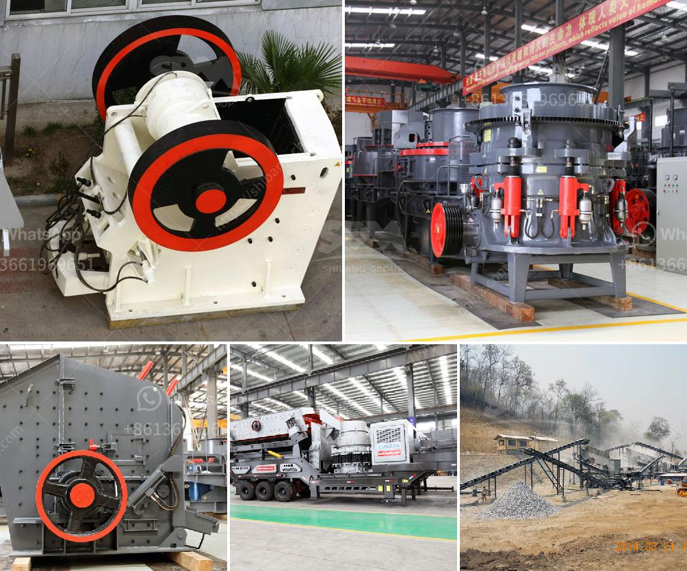

<h3>how to start stone crusher project</h3>
Stone crushing industry is an important industrial sector in the country. This is because stones are essential for the construction of houses, roads, bridges, hospitals, schools, and other infrastructural facilities. In addition, stones are also used for landscaping, decorating, and beautifying the surroundings.

Starting a stone crusher project is a crucial step in ensuring a stable and secure future for the construction industry. As the demand for stones continues to grow, more and more contractors are looking into starting their own crushing projects.

To start a stone crusher project, you need to identify the suitable location for the crushing plant. The selection of location is important because the crushing operation has a significant impact on the surrounding environment. This is where skilled professionals can assist you in finding the best location that meets all the regulatory requirements while also ensuring the least disturbance to the nearby residents.

Once the location is finalized, you need to obtain necessary permits and licenses from the local authorities. These permits are necessary to comply with all the legal and environmental regulations governing the stone crushing industry. Hiring a legal consultant can be helpful in navigating through the complex regulations and acquiring the required permits in a timely manner.

Once the legalities are taken care of, the next step is to purchase the necessary equipment for the crushing plant. You will need a primary crusher, secondary crusher, vibrating screen, belt conveyors, and control panel among others. It is important to choose reliable and durable equipment that can withstand the harsh conditions of the crushing process. Consulting with experienced suppliers can help you make informed choices regarding the equipment purchases.

After acquiring the equipment, you need to secure sufficient funds for the project. This can be done through personal savings, bank loans, or by attracting potential investors. It is crucial to have a well-developed business plan that includes the estimated budget, projected revenue, and expected return on investment. Presenting a comprehensive and convincing business plan to investors or financial institutions can increase the chances of securing funds for your project.

Once the funding is secured, you can start the construction of the crushing plant. Hiring skilled engineers, technicians, and laborers is essential to ensure a smooth implementation of the project. Regular supervision is also necessary to ensure that the construction is progressing as per the plan and within the allocated budget.

After the construction of the crushing plant is completed, it is crucial to undertake comprehensive testing and quality control procedures. This will ensure that the produced stones meet the required specifications and standards. Having a dedicated quality control team that monitors and tests the produced stones will help you build a strong reputation in the market.

In conclusion, starting a stone crusher project requires a lot of planning and preparation. It is crucial to ensure that all the necessary steps are followed and all the regulatory requirements are met. By seeking professional assistance and implementing effective strategies, you can successfully start and operate a profitable stone crusher project.
<h3>Contact us</h3><ul><li><strong>Whatsapp:&nbsp;<a href="https://wa.me/8613661969651">+8613661969651</a></strong></li><li><a href="https://swt.shibang-china.com/?git&amp;zhl&amp;how to start stone crusher project"><strong>Online Service(chat now)</strong></a></li></ul><h3>Related</h3><ul><li><a href='project cost of stone crusher of 100 tph.md'>project cost of stone crusher of 100 tph</a></li><li><a href='portable rock crusher rental.md'>portable rock crusher rental</a></li><li><a href='mining mining processing.md'>mining mining processing</a></li><li><a href='crushers in malaysia.md'>crushers in malaysia</a></li><li><a href='cost 100tpd cement plant india.md'>cost 100tpd cement plant india</a></li></ul>