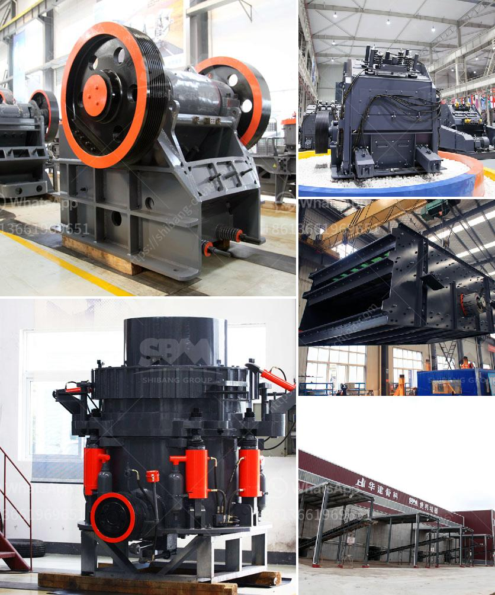

<h3>hp series cone crusher</h3>
The HP series cone crusher, also known as the Symons cone crusher, is a highly efficient cone crusher designed to provide the maximum productivity for the users. This cone crusher is widely used in industries such as mining, metallurgy, building material, highway, railway, and chemical industry to crush material with a compression strength of less than 350MPa. With its outstanding performance and high productivity, the HP cone crusher is the ideal choice for secondary and tertiary crushing.

One of the key features that make this cone crusher highly efficient is its high crushing ratio. Compared to other crushers, the HP cone crusher has a larger crushing chamber and more crushing layers, which can provide a higher crushing ratio and produce finer particles. This means that the HP cone crusher can effectively reduce the size of the material being crushed, resulting in a higher yield and better quality of the final product.

Another important feature of the HP series cone crusher is its hydraulic system. The hydraulic system ensures the smooth operation of the crusher by controlling the release of the hydraulic oil and adjusting the position of the crushing cone. This allows for automatic adjustment of the crusher settings to compensate for liner wear, ensuring consistent product size and reducing downtime.

In addition to its high crushing ratio and efficient hydraulic system, the HP series cone crusher also has several other features that contribute to its overall performance. For example, the cone crusher adopts advanced cavity design, which enables it to have a higher capacity and a better product shape. The use of laminated crushing principle also helps to reduce the wear of the crushing chamber and prolong the service life of the crusher.

Furthermore, the HP cone crusher is equipped with a variety of safety features to ensure the safety of both the operator and the equipment. These safety features include a hydraulic cylinder lock, which stops the crusher from operating when the chamber is not fully closed, and the automatic clearing system, which removes any uncrushable materials from the crushing chamber.

In conclusion, the HP series cone crusher is a high-performing crusher that provides the maximum productivity for the users. With its high crushing ratio, efficient hydraulic system, and advanced cavity design, this cone crusher can effectively reduce the size of the material being crushed, resulting in a higher yield and better quality of the final product. Its safety features also ensure the safety of both the operator and the equipment. Whether in mining, metallurgy, building material, highway, railway, or chemical industry, the HP cone crusher is a reliable choice for crushing needs.
<h3>Contact us</h3><ul><li><strong>Whatsapp:&nbsp;<a href="https://wa.me/8613661969651">+8613661969651</a></strong></li><li><a href="https://swt.shibang-china.com/?git&amp;zhl&amp;hp series cone crusher"><strong>Online Service(chat now)</strong></a></li></ul><h3>Related</h3><ul><li><a href='raymond mills mexico.md'>raymond mills mexico</a></li><li><a href='ball mill education.md'>ball mill education</a></li><li><a href='stone crusher in himachal pradesh.md'>stone crusher in himachal pradesh</a></li><li><a href='chinese gypsum production line equipment.md'>chinese gypsum production line equipment</a></li><li><a href='small scale mobile sand and stone crushers.md'>small scale mobile sand and stone crushers</a></li></ul>