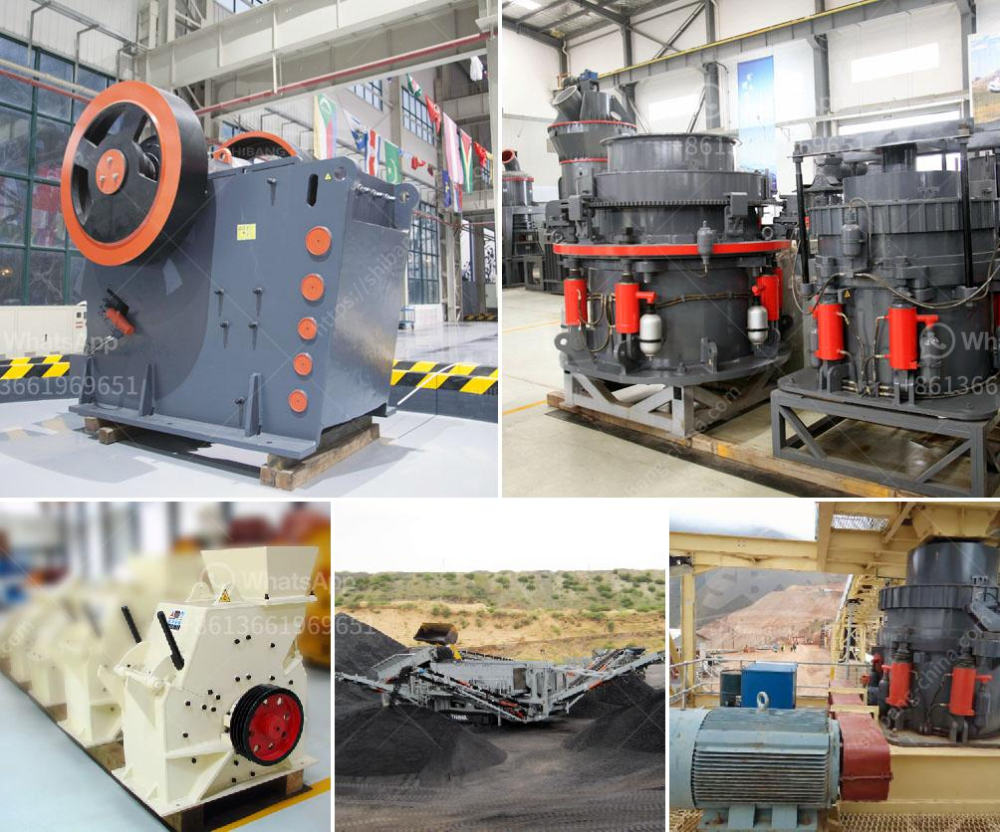

<h3>hydration process of cement</h3>
The hydration process of cement is an essential step in the creation of strong and durable concrete. Cement, when mixed with water, undergoes a series of chemical reactions that eventually result in the hardening of the mixture. This process is known as hydration and plays a crucial role in the overall quality and longevity of concrete structures.

Hydration begins immediately after water is added to cement. Within minutes, the initial chemical reaction takes place, leading to the formation of a gel-like substance known as calcium-silicate-hydrate (C-S-H). This gel acts as the glue that holds the aggregates together, giving concrete its strength.

As the hydration process progresses, more C-S-H is formed, filling in the gaps between particles of cement and aggregates. This process is crucial for the development of a dense and compact concrete structure. Additionally, other compounds such as calcium hydroxide (CH) and ettringite are also formed during hydration, contributing to the overall strength and durability of concrete.

The speed and extent of hydration depend on various factors such as cement composition, water-to-cement ratio, temperature, and curing conditions. An optimal water-to-cement ratio is essential to ensure complete hydration without excessive shrinkage or cracking. Too much water may weaken the final concrete structure, while too little water can hinder the hydration process.

Temperature also influences the hydration process. Higher temperatures lead to faster hydration, accelerating the formation of strength. However, excessive heat may cause thermal cracking, while lower temperatures can slow down hydration, prolonging the setting time. This is particularly important during colder weather conditions, as appropriate measures need to be taken to ensure proper curing and hydration.

Curing is a critical step in the hydration process and involves providing optimal moisture and temperature conditions for concrete to develop its full strength. Adequate curing allows the hydration reactions to continue for an extended period, leading to better bonding and increased durability. Common curing methods include the use of water or curing compounds, moisture-retaining coverings, and temperature control.

It is important to note that the hydration process does not stop once the concrete has hardened. In fact, hydration continues over an extended period, with the concrete gaining strength and durability over time. This phenomenon is known as long-term hydration or curing. Proper curing practices, such as providing sufficient moisture and avoiding premature drying, are crucial to ensuring the optimal development of concrete's properties.

In summary, the hydration process of cement is a complex series of chemical reactions that ultimately lead to the hardening of concrete. It is a time-dependent process that requires proper water-to-cement ratio, appropriate temperature, and adequate curing to ensure optimal strength and durability. Understanding the intricacies of hydration is vital for engineers, contractors, and anyone involved in the production of high-quality concrete structures.
<h3>Contact us</h3><ul><li><strong>Whatsapp:&nbsp;<a href="https://wa.me/8613661969651">+8613661969651</a></strong></li><li><a href="https://swt.shibang-china.com/?git&amp;zhl&amp;hydration process of cement"><strong>Online Service(chat now)</strong></a></li></ul><h3>Related</h3><ul><li><a href='prices of industrial conveyor belts.md'>prices of industrial conveyor belts</a></li><li><a href='business plan on manganese ore mining.md'>business plan on manganese ore mining</a></li><li><a href='ball mills vietnam.md'>ball mills vietnam</a></li><li><a href='coal conveyor blet supplier from india.md'>coal conveyor blet supplier from india</a></li><li><a href='prices of coal pulverizers.md'>prices of coal pulverizers</a></li></ul>