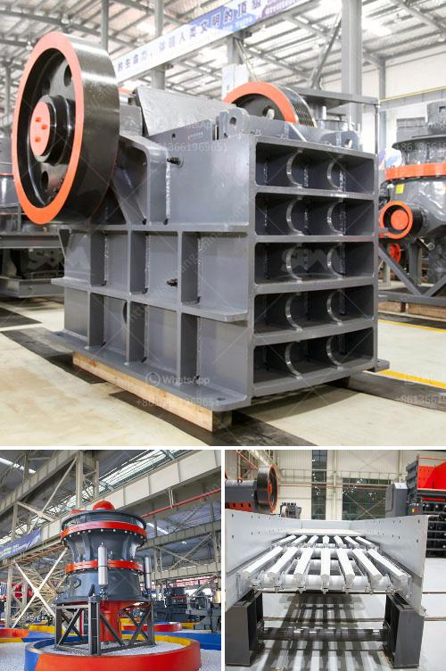

<h3>hydraulic concrete crusher</h3>
Hydraulic concrete crushers are used to demolish concrete structures and save time, effort, and costs. The concept is simple; rather than using traditional concrete demolishing methods such as explosives, the hydraulic crusher uses powerful hydraulic forces to forcefully crush concrete into smaller pieces.

One of the main advantages of hydraulic concrete crushers is their versatility. They can be used to demolish concrete structures of various sizes and types, ranging from smaller residential buildings to larger commercial and industrial projects. The hydraulic crusher can easily reduce concrete rubble to a much smaller size, while still ensuring that any valuable rebar or metal components are not damaged in the process.

The hydraulic crusher is equipped with powerful jaws that can easily crush thick concrete walls, allowing contractors to demolish structures with ease. However, it is important to note that hydraulic concrete crushers should be operated with care and caution to prevent any accidents or mishaps. Operators should undergo proper training and familiarize themselves with the specific instructions provided by the manufacturer before using these machines.

One key feature of hydraulic concrete crushers is their ability to demolish concrete silently. Unlike traditional methods that often involve loud explosions or heavy machinery, hydraulic crushers can quietly and efficiently demolish structures without causing excessive noise and disturbance. This makes them particularly useful in urban areas where noise regulations are strictly enforced or in residential neighborhoods where minimizing noise is crucial.

Moreover, hydraulic concrete crushers are designed to be lightweight and portable, making them easy to transport and maneuver on construction sites. Their compact size allows them to access tight spaces, making them ideal for demolishing concrete within confined areas. The ability to reach difficult-to-access areas ensures that no part of the structure is left untouched during the demolition process.

In addition to their efficiency, hydraulic concrete crushers also offer environmental benefits. By avoiding the use of explosives, these crushers minimize airborne dust and prevent potential harm to nearby structures or individuals. The ability to crush concrete on-site also reduces the need for transport, thereby reducing carbon emissions and fuel costs associated with hauling rubble to and from the site.

In conclusion, hydraulic concrete crushers offer a safe, efficient, and environmentally friendly method of demolishing concrete structures. Their versatility and ease of use make them a valuable tool for contractors working on a wide range of projects. By opting for hydraulic crushers, construction professionals can save time, effort, and costs, while ensuring a safe and controlled demolition process.
<h3>Contact us</h3><ul><li><strong>Whatsapp:&nbsp;<a href="https://wa.me/8613661969651">+8613661969651</a></strong></li><li><a href="https://swt.shibang-china.com/?git&amp;zhl&amp;hydraulic concrete crusher"><strong>Online Service(chat now)</strong></a></li></ul><h3>Related</h3><ul><li><a href='lm vertical mill.md'>lm vertical mill</a></li><li><a href='gypsum powder grinding mill price in pakistan.md'>gypsum powder grinding mill price in pakistan</a></li><li><a href='coal mill grinding rolls.md'>coal mill grinding rolls</a></li><li><a href='ball mills vietnam.md'>ball mills vietnam</a></li><li><a href='how to grind sand into powder.md'>how to grind sand into powder</a></li></ul>