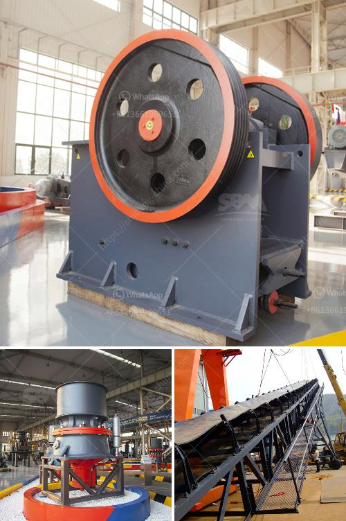

<h3>hydraulic conveyor belts</h3>
Conveyor belts have long been a fundamental component of industrial processes, facilitating the seamless movement of materials from one point to another. These belts have undergone countless transformations over the years, but none as groundbreaking as the advent of hydraulic conveyor belts. Utilizing hydraulic power, these innovative belts offer unprecedented levels of efficiency and versatility in material handling.

Hydraulic conveyor belts have revolutionized the manufacturing and mining industries, among others, by simplifying the transport of heavy or bulk materials. The hydraulic system propels the belt, providing a smooth and reliable flow, regardless of the weight or type of material being transported. This automation considerably reduces manual labor, saving time, and improving overall productivity.

One of the key advantages of hydraulic conveyor belts is their ability to adapt to various terrains and angles with ease. Thanks to their hydraulic system, these belts can navigate inclines, curves, or other challenging surfaces smoothly, eliminating the need for additional equipment or human intervention.

Another significant benefit lies in their strong and durable construction. Hydraulic conveyor belts are typically made of high-quality materials, ensuring them to withstand heavy loads and harsh working conditions. This durability saves costs on maintenance and belt replacements, making them a cost-effective option for industries.

Safety is always a paramount concern in any industrial setting. Hydraulic conveyor belts are designed with advanced safety features, such as emergency stops and automatic shut-offs. These measures help prevent accidents or injuries, making the working environment more secure for employees.

Furthermore, hydraulic conveyor belts are highly customizable, allowing for seamless integration into existing systems or the adaptation to specific requirements. They can be easily adjusted in terms of speed, tension, or width, ensuring optimal performance and efficiency for every application.

In conclusion, hydraulic conveyor belts have transformed the material handling industry, improving efficiency, productivity, and safety. Their ability to handle heavy loads, navigate challenging terrains, and incorporate advanced safety features makes them a valuable asset for various industries. As technology continues to evolve, these innovative belts are expected to further advance, making material handling more efficient and streamlined than ever before.
<h3>Contact us</h3><ul><li><strong>Whatsapp:&nbsp;<a href="https://wa.me/8613661969651">+8613661969651</a></strong></li><li><a href="https://swt.shibang-china.com/?git&amp;zhl&amp;hydraulic conveyor belts"><strong>Online Service(chat now)</strong></a></li></ul><h3>Related</h3><ul><li><a href='hand portable rock crusher.md'>hand portable rock crusher</a></li><li><a href='horizontal shaft impact crusher.md'>horizontal shaft impact crusher</a></li><li><a href='how to grind sand into powder.md'>how to grind sand into powder</a></li><li><a href='production of barium sulfate main plant equipment.md'>production of barium sulfate main plant equipment</a></li><li><a href='mobile stone crusher in saudi.md'>mobile stone crusher in saudi</a></li></ul>