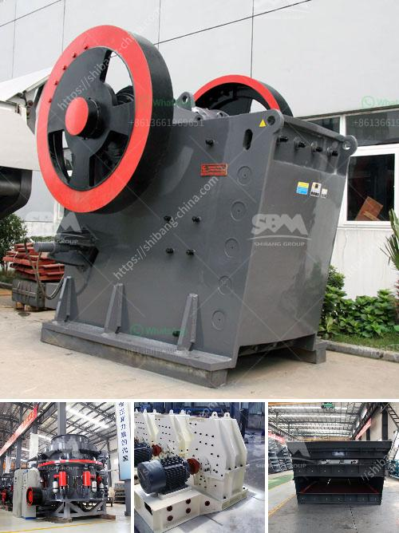

<h3>hydro classifier silica sand</h3>
Silica sand is a widely used material in various industries, especially in the construction and glassmaking sectors. Known for its high purity and desirable physical and chemical properties, silica sand is valued for its versatility and reliability in different applications. However, before it can be utilized in these industries, the silica sand must undergo a comprehensive processing stage to remove impurities and ensure its compliance with industry standards. One of the most efficient methods for processing silica sand is through the utilization of hydro classifiers.

Hydro classifiers, also known as density separators, are innovative machines designed to remove impurities and improve the quality of silica sand. The equipment relies on the principle of density separation, where materials with different densities are separated based on their specific gravity. In the case of silica sand, the hydro classifier separates impurities such as clay particles and organic matter, resulting in a high-quality final product.

The process of hydro classification begins with the introduction of a slurry mixture of silica sand and water into the hydro classifier tank. Inside the tank, the slurry moves through a series of interconnected chambers, each having a specific purpose in the separation process. The hydro classifier is equipped with adjustable valves and compartments, allowing operators to control the flow of the slurry and adjust the separation criteria based on the desired final product specifications.

As the slurry moves through the chambers, a combination of gravity and centrifugal forces act on the particles, resulting in their separation based on density. Lighter particles, such as clay and organic matter, tend to rise to the surface and are discharged as overflow, while heavier silica sand particles settle at the bottom and are collected as underflow. This separation mechanism ensures that only the high-quality silica sand particles are retained, while impurities are effectively removed.

One of the key advantages of utilizing hydro classifiers for processing silica sand is their ability to handle a wide range of particle sizes. Depending on the specific requirements of the end-users, hydro classifiers can be adjusted to accommodate different size fractions, thus enabling the production of various grades of silica sand. Additionally, the equipment can be easily integrated into existing processing plants, minimizing the need for major modifications or investments in new infrastructure.

Another notable benefit of hydro classifiers is their high efficiency and cost-effectiveness. The hydro classification process relies on the forces of gravity and centrifugation, which are energy-efficient compared to other separation methods. Furthermore, the low maintenance requirements of hydro classifiers translate into reduced operational costs, making them an economical choice for silica sand processing plants. The ability to separate impurities effectively also results in a significant reduction in waste generation, allowing for more sustainable and environmentally-friendly production.

In conclusion, hydro classifiers have revolutionized the processing of silica sand by offering a highly efficient and cost-effective method for impurity removal. Their ability to separate impurities based on density ensures the production of high-quality silica sand, meeting the stringent requirements of various industries. With their versatility, ease of integration, and environmental benefits, hydro classifiers have become an indispensable tool in the silica sand processing sector. As the demand for silica sand continues to grow, the utilization of hydro classifiers presents an innovative solution for the industry's evolving needs.
<h3>Contact us</h3><ul><li><strong>Whatsapp:&nbsp;<a href="https://wa.me/8613661969651">+8613661969651</a></strong></li><li><a href="https://swt.shibang-china.com/?git&amp;zhl&amp;hydro classifier silica sand"><strong>Online Service(chat now)</strong></a></li></ul><h3>Related</h3><ul><li><a href='robo sand making equipment rates in india.md'>robo sand making equipment rates in india</a></li><li><a href='stone crusher second hand south africa.md'>stone crusher second hand south africa</a></li><li><a href='gold recovery equipment for small mining companies.md'>gold recovery equipment for small mining companies</a></li><li><a href='price high energy ball milling.md'>price high energy ball milling</a></li><li><a href='vertical grinding machine for marble.md'>vertical grinding machine for marble</a></li></ul>