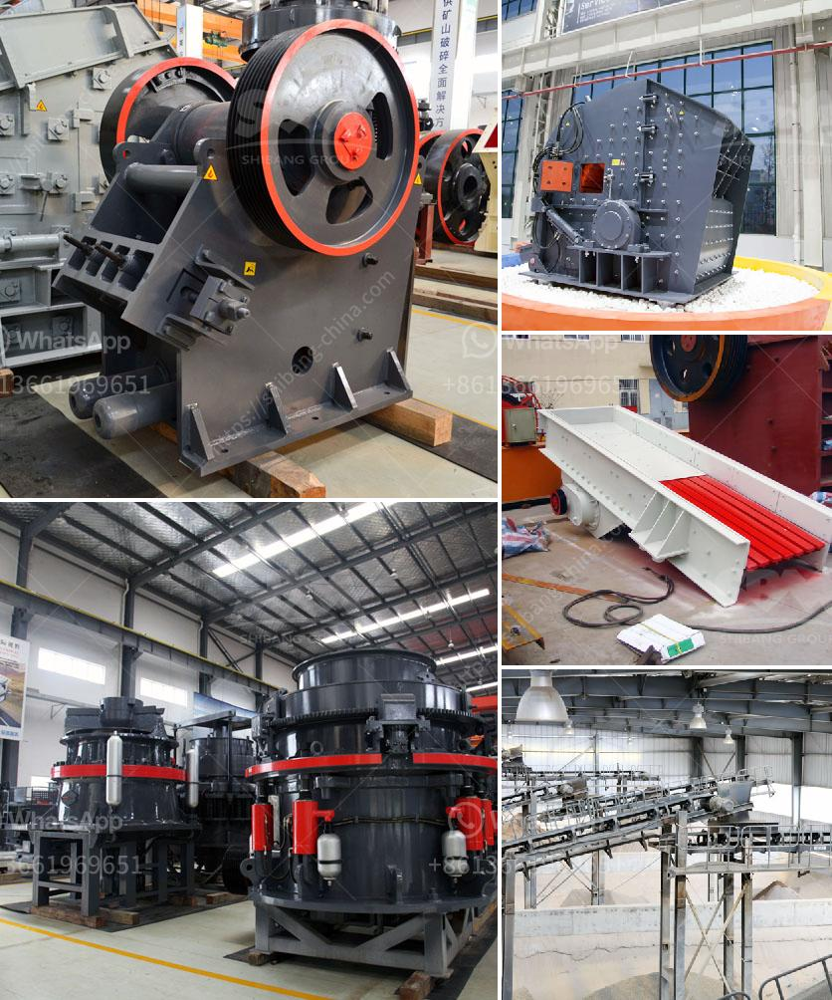

<h3>impact crusher for sale saudi</h3>
The demand for impact crusher is increasing steadily Saudi Arabia owing to its high productivity, low operating cost, and ability to produce uniform cubical particles. This crusher plays a significant role in the building material industry, infrastructure development, and mining industry. The rapid industrialization in Saudi Arabia is creating a huge demand for impact crushers to crush raw materials that are used in various construction projects. 

The impact crusher is designed to crush materials with a higher compressive strength, such as limestone, granite, and gravel, as well as other materials that are less abrasive, such as coal and asphalt. It can process large rocks into smaller sizes to suit different requirements. This makes it suitable for a wide range of applications, including road building, railway construction, and concrete production.

One of the main advantages of the impact crusher is its ability to produce a uniform cubical shape. Traditional crushers, such as jaw crushers and cone crushers, often produce irregular and elongated particles, which may not be suitable for certain applications. However, the impact crusher uses a combination of impact and attrition forces to break the material, resulting in a more uniform and cubical shape. This makes it an ideal choice for producing high-quality aggregates for use in the construction industry.

Another advantage of the impact crusher is its low operating cost. It consumes less energy compared to other crushers and requires minimal maintenance. This can result in significant cost savings over time, making it a cost-effective choice for businesses in Saudi Arabia. Additionally, the impact crusher is designed with various safety features to ensure the protection of workers and the equipment.

Saudi Arabia has an abundance of natural resources, including oil and gas, which has led to a thriving mining industry. The impact crusher is widely used in the mining industry due to its ability to crush materials with a high hardness and high abrasiveness. This versatility makes it invaluable for various mining applications, such as crushing ores and rocks to extract valuable minerals.

The impact crusher for sale in Saudi Arabia is available in a variety of configurations and sizes, enabling adaptability to suit different customer requirements. These machines can be stationary or mobile, depending on the location and nature of the project. Mobile impact crushers offer greater flexibility, allowing the crusher to be moved to different sites as needed.

In conclusion, the impact crusher plays a crucial role in Saudi Arabia's construction industry and mining sector. Its ability to produce uniform cubical particles, low operating cost, and versatility make it a valuable asset for businesses in the country. With the increasing demand for construction materials and minerals, the impact crusher is expected to continue its growth and contribute significantly to the development of the Saudi Arabian economy.
<h3>Contact us</h3><ul><li><strong>Whatsapp:&nbsp;<a href="https://wa.me/8613661969651">+8613661969651</a></strong></li><li><a href="https://swt.shibang-china.com/?git&amp;zhl&amp;impact crusher for sale saudi"><strong>Online Service(chat now)</strong></a></li></ul><h3>Related</h3><ul><li><a href='stone crusher in malaysia.md'>stone crusher in malaysia</a></li><li><a href='calcite grinding process.md'>calcite grinding process</a></li><li><a href='crushers and wash plant processes.md'>crushers and wash plant processes</a></li><li><a href='copper manufacturing process.md'>copper manufacturing process</a></li><li><a href='concrete crusher for sale in nigeria.md'>concrete crusher for sale in nigeria</a></li></ul>