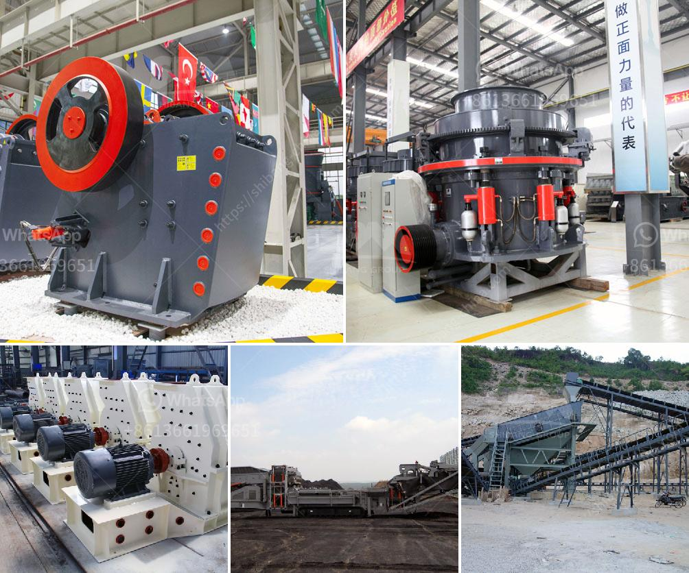

<h3>impact crusher on sale</h3>
When it comes to the construction and mining industries, nothing quite beats the versatility of an impact crusher. The hard-hitting machine revolutionized crushing technology, providing a cost-effective and efficient solution for breaking down rocks and other materials. With an impact crusher on sale, construction and mining companies can take advantage of this game-changing piece of equipment to boost productivity and maximize profits.

An impact crusher, also known as a horizontal shaft impactor, is commonly used in quarrying, mining, and recycling applications. It utilizes a high-speed rotor and anvils to effectively break down materials, such as limestone, concrete, and asphalt. The impact process generates intense forces that efficiently crush the feed material into smaller sizes.

One of the main advantages of an impact crusher is its ability to produce a cubical product. Unlike other crushing machines, such as jaw crushers or cone crushers, impact crushers create a more uniform shape, making them ideal for producing high-quality aggregates for construction projects. The cubical shape also enhances the performance of concrete and asphalt, ensuring a stronger and more durable finished product.

Furthermore, impact crushers offer a high reduction ratio, meaning they can efficiently reduce the size of the feed material without sacrificing productivity. This makes them suitable for a wide range of applications, from primary crushing to the final stage of secondary crushing.

With advancements in technology, impact crushers have also become more versatile and customizable. Many manufacturers now offer a variety of configurations and options to suit specific requirements. For example, some impact crushers feature interchangeable wear parts, allowing operators to easily replace and maintain components to maximize uptime and reduce operating costs.

In addition to their versatility and productivity, impact crushers are also known for their user-friendly design. Many models come with hydraulic systems that enable easy adjustment of the apron settings, ensuring precise control over the size and shape of the final product. They also often feature a fully hydraulic opening mechanism, allowing quick and easy access to the rotor and aprons for maintenance purposes.

As with any piece of machinery, selecting the right impact crusher for your specific needs is crucial. Factors to consider include the feed size, desired product size, and the required capacity. It is advisable to consult with a reputable and experienced supplier who can assess your requirements and recommend the most suitable impact crusher model.

With the impact crusher's numerous advantages and its potential to significantly improve the efficiency of crushing operations, it is no wonder that they are highly sought after in the construction and mining industries. As a result, there are often impact crushers on sale, offering companies an opportunity to acquire this game-changing equipment at a more affordable price.

In conclusion, an impact crusher on sale presents a valuable opportunity for construction and mining companies to enhance their operations. The versatility, productivity, and cost-effectiveness of impact crushers make them a popular choice for breaking down rocks and other materials. With advancements in technology, these machines have become even more customizable and user-friendly, further boosting their appeal. Consider investing in an impact crusher on sale to take your crushing capabilities to the next level.
<h3>Contact us</h3><ul><li><strong>Whatsapp:&nbsp;<a href="https://wa.me/8613661969651">+8613661969651</a></strong></li><li><a href="https://swt.shibang-china.com/?git&amp;zhl&amp;impact crusher on sale"><strong>Online Service(chat now)</strong></a></li></ul><h3>Related</h3><ul><li><a href='crusher price in philippines.md'>crusher price in philippines</a></li><li><a href='types conveyor belts.md'>types conveyor belts</a></li><li><a href='jaw crusher in dubai.md'>jaw crusher in dubai</a></li><li><a href='cost of cement manufacturing machine china.md'>cost of cement manufacturing machine china</a></li><li><a href='limestone crusher screening types plant.md'>limestone crusher screening types plant</a></li></ul>