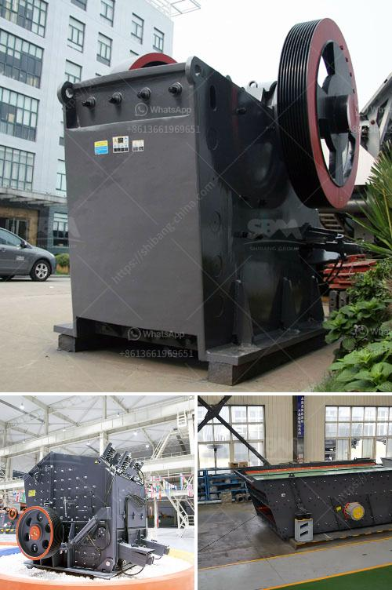

<h3>impact crusher plant price</h3>
Impact crusher, also known as impactor crusher or stone crushing machine, is a versatile and efficient crushing machine that can crush various materials. Due to its excellent performance and high crushing ratio, impact crusher is widely used in many industries such as construction, mining, cement, chemicals, energy, and metallurgy.

One important factor that determines the price of impact crusher plant is the crusher configuration. Different configurations have different prices. For example, the impact crusher plant with a single rotor has low production cost, while the one with a double rotor has high production cost. In addition, the impact crusher plant with different feed sizes and discharge sizes also has different prices. Generally, the larger the feed size, the higher the price of the impact crusher plant.

The brand of impact crusher plant is also an influential factor. Different brands have different prices due to their different marketing strategies, product quality, and after-sales service. Well-known brands often have higher prices, but they also come with better product quality and reliable after-sales service. It is important to choose a reputable and reliable brand when purchasing an impact crusher plant to ensure its long-term performance and durability.

Moreover, the price of impact crusher plant is also affected by the production capacity. The higher the production capacity, the higher the price. Impact crusher plants with different production capacities can meet the needs of different customers. If you have a large-scale production demand, it is recommended to choose an impact crusher plant with a higher production capacity, even though it may have a higher price. On the other hand, if your production demand is relatively small, you can choose an impact crusher plant with a lower production capacity to save costs.

Additionally, the technology and quality of impact crusher plant directly affect its price. Impact crusher plants with advanced technology and high-quality components tend to have higher prices. However, they also offer better performance, higher efficiency, and longer service life, which can ultimately save costs over the long run. Investing in a high-quality impact crusher plant can bring considerable benefits to your production process and overall operational efficiency.

In summary, when considering the price of an impact crusher plant, factors such as crusher configuration, brand, production capacity, and technology should be taken into account. It is recommended to choose a reputable brand with advanced technology and high-quality components, even though it may have a higher price. Investing in a high-quality impact crusher plant can bring significant benefits in terms of production efficiency, product quality, and overall operational costs.
<h3>Contact us</h3><ul><li><strong>Whatsapp:&nbsp;<a href="https://wa.me/8613661969651">+8613661969651</a></strong></li><li><a href="https://swt.shibang-china.com/?git&amp;zhl&amp;impact crusher plant price"><strong>Online Service(chat now)</strong></a></li></ul><h3>Related</h3><ul><li><a href='ball mill machine in china.md'>ball mill machine in china</a></li><li><a href='chili powder grinding machinery.md'>chili powder grinding machinery</a></li><li><a href='gypsum powder grinding mill price in pakistan.md'>gypsum powder grinding mill price in pakistan</a></li><li><a href='cost of mining process of calcium carbonate.md'>cost of mining process of calcium carbonate</a></li><li><a href='screening and wash plant manufacturers in south africa.md'>screening and wash plant manufacturers in south africa</a></li></ul>