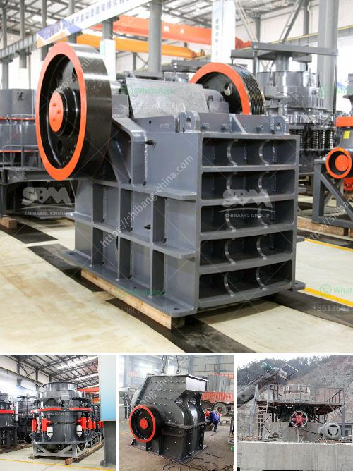

<h3>impact crusher saudi arabia</h3>
The impact crusher has proven to be an essential equipment in Saudi Arabia as it fulfills the vision of developing the nation's infrastructure. It enables the construction of high-rise buildings, expressways, airports, ports, and mega-projects. This makes it lucrative for transportation, construction, and mining industries.

The country’s rapid urbanization has led to an increase in demand for building materials such as gravel, marble chips, and other aggregates. This surge in demand has necessitated the need for efficient and effective crushers to enhance productivity and expedite construction projects. The impact crusher, with its cutting-edge design, provides a unique value proposition in Saudi Arabia as it delivers both crushing and shaping functionalities.

Impact crushers are ideal for producing high-quality end products economically. They have a high ratio of reduction, direct control of product size, and excellent cubical shape. Their multiple crushing chambers and adjustable rotor speeds coupled with hydraulic adjustment mechanisms maximize productivity and minimize production costs.

One of the primary advantages of the impact crusher is its ability to handle heavy and abrasive materials. With a maximum feed size of 500mm and a rotor diameter of 1,260mm, the impact crusher can easily cope with a wide range of materials, including limestone, construction debris, asphalt, and concrete. These materials are crushed and reshaped to create consistent, high-quality aggregates. This is crucial in the construction industry, where the need for standardized and reliable building materials is paramount.

Moreover, the impact crusher’s innovative design ensures easy maintenance and operation. With features like hydraulic overload protection and reversible rotation, the crusher can process materials more efficiently and minimize downtime due to blockages or tramp iron. This translates to increased profits for operators and project developers.

Saudi Arabia’s commitment to sustainable development aligns perfectly with the impact crusher technology. By recycling construction and demolition waste, these crushers reduce environmental impact and conserve valuable resources. The ability to produce graded and shaped materials also reduces the need for natural aggregates, further minimizing the impact on the environment.

The impact crusher is also equipped with modern safety features such as emergency stop buttons, centralized greasing systems, and easy access to all the crusher components. This enables operators to quickly respond to any potential hazards and ensure the safety of the workforce.

The Saudi government has recognized the significance of impact crushers and has implemented policies to encourage their use in construction projects. As a result, leading manufacturers of impact crushers have introduced various models tailored to cater to the specific demands of the Saudi market. These models offer increased efficiency, durability, and reliability, ensuring a smooth and uninterrupted construction process.

In conclusion, the impact crusher is a game-changer in the Saudi Arabian construction industry, as it enables the rapid development of the nation’s infrastructure. The demand for high-quality aggregates is ever-growing, and the impact crusher provides the perfect solution for producing them. Its advanced design, efficient functionality, and environmental sustainability make it an invaluable asset for the construction industry in Saudi Arabia.
<h3>Contact us</h3><ul><li><strong>Whatsapp:&nbsp;<a href="https://wa.me/8613661969651">+8613661969651</a></strong></li><li><a href="https://swt.shibang-china.com/?git&amp;zhl&amp;impact crusher saudi arabia"><strong>Online Service(chat now)</strong></a></li></ul><h3>Related</h3><ul><li><a href='rock crusher mercadolibre.md'>rock crusher mercadolibre</a></li><li><a href='slag crusher makers in india.md'>slag crusher makers in india</a></li><li><a href='mobile jaw crusher for sale.md'>mobile jaw crusher for sale</a></li><li><a href='ultra conveyor belts usa.md'>ultra conveyor belts usa</a></li><li><a href='gravel making machine.md'>gravel making machine</a></li></ul>