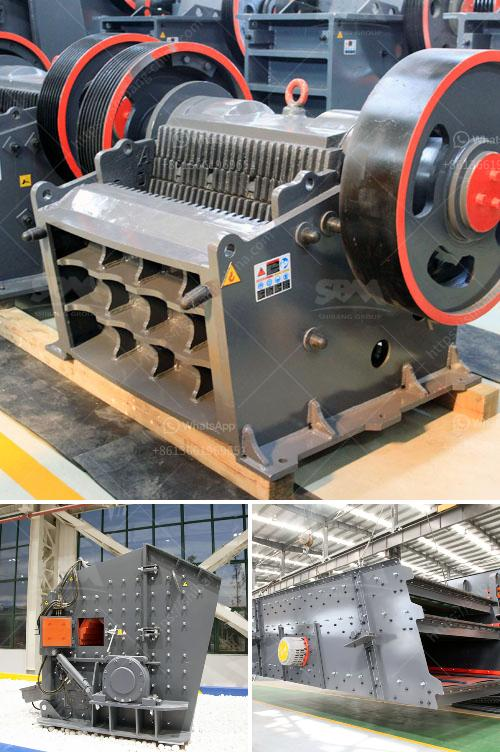

<h3>impact crusher specification limestone</h3>
When it comes to the impact crusher specification for limestone, the focus is on the material hardness, kink condition, and desired output size. The hardness of the material determines the rotor speed and the suitable stone dimensions while the kink condition specifies the inlet opening dimensions. Additionally, the desired output size determines the crusher's crushing capacity and the number of required hammer hits.

Limestone is a commonly used natural stone that is widely available in various forms, from small pebbles to massive boulders. Due to its versatile nature and exceptional durability, limestone is widely used in construction and architecture. But in order to effectively process limestone, an appropriate impact crusher is required.

The impact crusher is a machine that uses impact energy to crush materials. It works by feeding the limestone into the rotor where the hammer action crushes it against the walls, resulting in reduced stone size. This process ensures that the limestone is crushed to the required specifications.

When choosing an impact crusher for limestone crushing, it is important to ensure that the crusher meets the required specifications. The specification should include the maximum feed size, the crushing capacity, the rotor speed, and the required product size. These specifications will ensure that the crusher is capable of processing the limestone effectively and producing the desired output size.

Furthermore, the specific type of impact crusher should be selected based on the required specifications. Common types include horizontal shaft impact crushers (HSI) and vertical shaft impact crushers (VSI). HSI crushers are more commonly used for softer materials like limestone, whereas VSI crushers are ideal for harder materials with higher compressive strength.

In conclusion, choosing the right impact crusher specification for limestone is crucial in order to effectively process the stone and achieve the desired results. The material hardness, kink condition, and desired product size should be carefully considered when selecting the suitable crusher. By doing so, high-quality crushed limestone can be produced efficiently, ensuring its suitability for various construction and architectural applications.
<h3>Contact us</h3><ul><li><strong>Whatsapp:&nbsp;<a href="https://wa.me/8613661969651">+8613661969651</a></strong></li><li><a href="https://swt.shibang-china.com/?git&amp;zhl&amp;impact crusher specification limestone"><strong>Online Service(chat now)</strong></a></li></ul><h3>Related</h3><ul><li><a href='coal mill crusher for sale stone crusher machine.md'>coal mill crusher for sale stone crusher machine</a></li><li><a href='largest quarry machine manufacturer.md'>largest quarry machine manufacturer</a></li><li><a href='the company mines limestone in ethiopia.md'>the company mines limestone in ethiopia</a></li><li><a href='lm vertical mill.md'>lm vertical mill</a></li><li><a href='coal crushing and screening plant for sale south africa.md'>coal crushing and screening plant for sale south africa</a></li></ul>