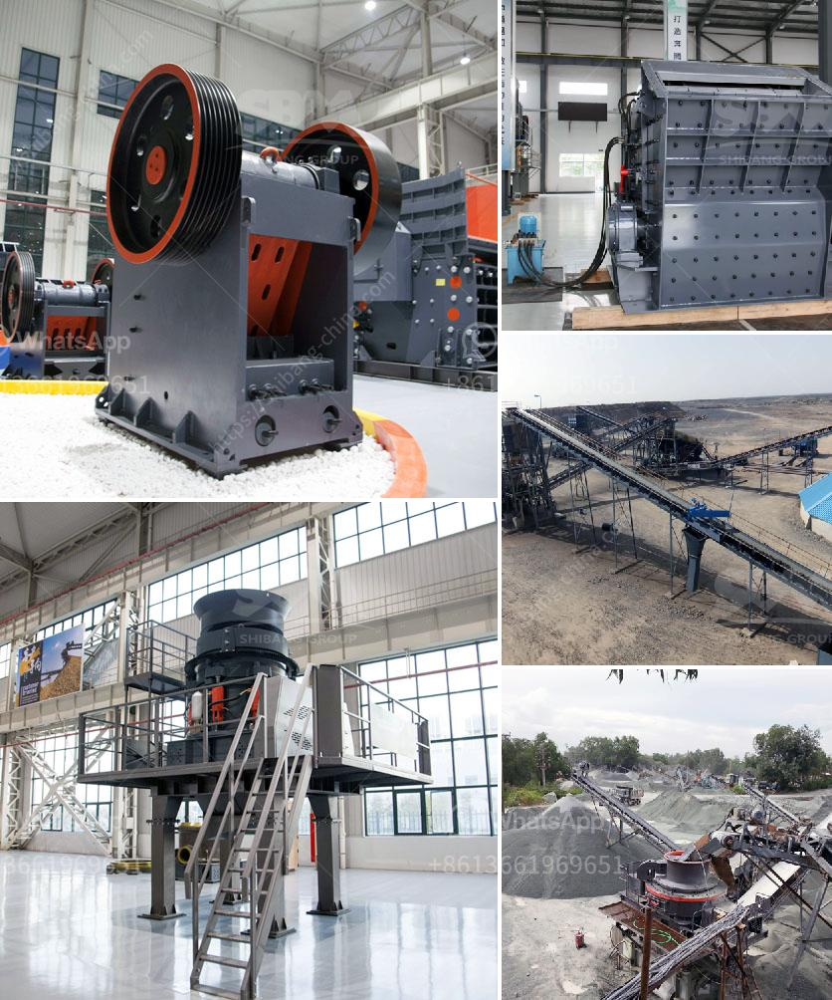

<h3>impact crusher supplier</h3>
In the construction and mining industry, utilizing the right type of equipment is essential for achieving optimal results. Crushing is a stage that plays a significant role in the processing of raw materials. Quality crushing equipment will have a substantial impact on the efficiency and productivity of operations. Therefore, selecting a reliable supplier for impact crushers is crucial. This article will explore the importance of impact crusher suppliers and discuss a few renowned suppliers that are known for offering high-quality machines.

Impact crushers are widely used in various industries, including mining, construction, and recycling. They are commonly used to crush large rocks, ores, and demolition debris into smaller sizes for further processing. The main advantage of using an impact crusher is its ability to produce a well-shaped and graded final product. It accomplishes this by using kinetic energy generated by the rotor to impact the material and break it into smaller pieces.

When looking for an impact crusher supplier, it is imperative to consider key factors such as the supplier's reputation, experience, product quality, and after-sales support. A reliable supplier will not only provide high-quality machines but also offer expert guidance, timely maintenance, and responsive customer service.

One renowned impact crusher supplier is ABC Machinery. With over 20 years of experience in the industry, ABC Machinery has earned a stellar reputation for delivering superior crushing equipment. Their impact crushers are known for their robust construction, high crushing capacity, and advanced technology. Furthermore, ABC Machinery offers comprehensive after-sales support to ensure their customers maximize the efficiency and lifespan of their machines.

Another trusted supplier is XYZ Equipment. XYZ Equipment has been supplying impact crushers to the construction and mining industry for over a decade. They are known for their durable and reliable machines that can handle a wide range of materials. XYZ Equipment also provides excellent after-sales service, including on-site training and 24/7 technical support.

CRUSHER Inc. is another notable impact crusher supplier with a long-standing presence in the market. They offer a wide range of impact crushers, including horizontal shaft impactors and vertical shaft impactors. CRUSHER Inc. is known for its commitment to quality, innovation, and customer satisfaction. They have a team of experienced professionals who are dedicated to assisting customers in selecting the best-suited crusher for their specific requirements.

In conclusion, selecting a reliable impact crusher supplier is crucial for any construction or mining operation. A reputable supplier will not only offer high-quality machines but also provide comprehensive after-sales support. When choosing a supplier, consider factors like the supplier's reputation, experience, product quality, and after-sales service. ABC Machinery, XYZ Equipment, and CRUSHER Inc. are a few renowned impact crusher suppliers known for their quality products and excellent customer service. By partnering with a reliable supplier, businesses can ensure they have the right equipment to achieve optimal crushing results.
<h3>Contact us</h3><ul><li><strong>Whatsapp:&nbsp;<a href="https://wa.me/8613661969651">+8613661969651</a></strong></li><li><a href="https://swt.shibang-china.com/?git&amp;zhl&amp;impact crusher supplier"><strong>Online Service(chat now)</strong></a></li></ul><h3>Related</h3><ul><li><a href='stone crushers in china.md'>stone crushers in china</a></li><li><a href='hammer mills for sand.md'>hammer mills for sand</a></li><li><a href='slag grinding plant.md'>slag grinding plant</a></li><li><a href='stone crushers turkey.md'>stone crushers turkey</a></li><li><a href='limestone processing equipment.md'>limestone processing equipment</a></li></ul>