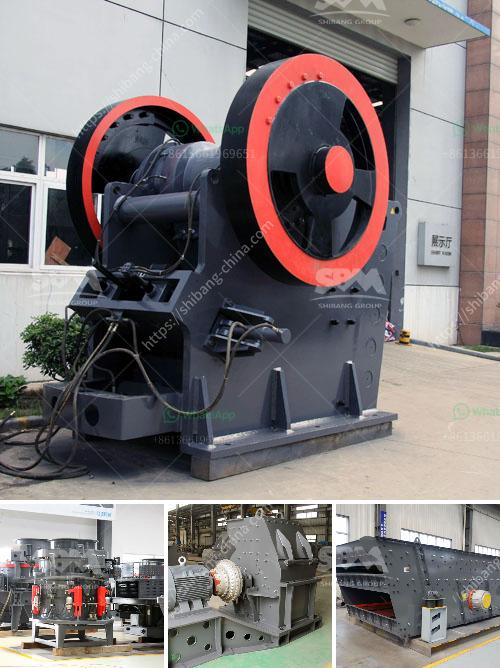

<h3>impactor crusher for sale south africa price</h3>
The construction industry is booming in South Africa, and this trend has led to a high demand for crushing equipment. Impactor crushers are widely used in the construction and mining industry for crushing various materials such as granite, limestone, concrete, and more. If you are in the market for an impactor crusher, you may be wondering about the prices and availability in South Africa.

When it comes to purchasing an impactor crusher in South Africa, the prices can vary significantly depending on multiple factors. The first factor to consider is the type of crusher that suits your specific needs. There are different types of impactor crushers available, such as horizontal shaft impact crushers and vertical shaft impact crushers. Each type has its own advantages and applications, and the prices may vary accordingly.

The second factor that affects the price of an impactor crusher in South Africa is the brand and the quality of the product. Well-known brands often tend to have higher prices due to their reputation, while lesser-known brands may offer more affordable options. However, it is essential to consider the quality of the crusher and ensure that it meets the necessary standards to ensure its durability and performance in the long run.

Additionally, the capacity and size of the impactor crusher can also impact its price. Higher capacity crushers tend to be more expensive as they can process larger quantities of material, thus increasing productivity. On the other hand, smaller crushers may have a lower price but can accommodate less material at a time. It is crucial to determine your specific needs and requirements to find the best balance between price and capacity.

The market competition in South Africa can also influence the price of impactor crushers. With numerous suppliers and manufacturers, the prices may vary significantly. It is recommended to research and compare prices from different suppliers to ensure that you are getting the best deal for your budget.

When looking for an impactor crusher for sale in South Africa, it is also important to consider the after-sales service and support provided by the supplier. A reliable supplier should offer technical support, spare parts availability, and maintenance services to ensure the smooth and efficient operation of the crusher.

In conclusion, the price of impactor crushers for sale in South Africa can vary depending on factors such as the type of crusher, brand, capacity, and market competition. It is crucial to do thorough research, compare prices, and consider factors such as quality and after-sales services before making a purchase decision. By doing so, you can find an impactor crusher that suits your specific needs and budget, ensuring optimal productivity and efficiency in your construction or mining projects.
<h3>Contact us</h3><ul><li><strong>Whatsapp:&nbsp;<a href="https://wa.me/8613661969651">+8613661969651</a></strong></li><li><a href="https://swt.shibang-china.com/?git&amp;zhl&amp;impactor crusher for sale south africa price"><strong>Online Service(chat now)</strong></a></li></ul><h3>Related</h3><ul><li><a href='dolomite crusher price.md'>dolomite crusher price</a></li><li><a href='hammer mill machine.md'>hammer mill machine</a></li><li><a href='crusher plant in kenya.md'>crusher plant in kenya</a></li><li><a href='clinker grinding unit of 1000 tpd.md'>clinker grinding unit of 1000 tpd</a></li><li><a href='flowsheet for crushing plant.md'>flowsheet for crushing plant</a></li></ul>