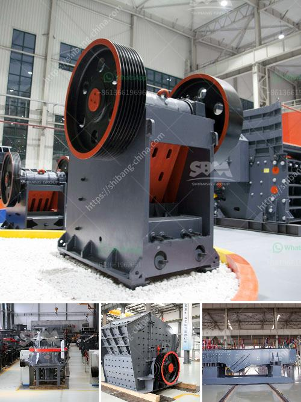

<h3>india manufacturers for small ball mills</h3>
India is known for its diverse manufacturing sector, with industries ranging from automobiles to textiles to pharmaceuticals. Amidst this wide array of industries, India has also emerged as a hub for ball mill manufacturing. A ball mill is a device used to grind materials into fine powder, making it ideal for use in various industries like paint, ceramic, and pyrotechnics. India manufacturers offer an extensive range of small ball mills that are highly efficient and reliable.

One of the key advantages of India manufacturers for small ball mills is their ability to provide cost-effective solutions. These manufacturers specialize in producing compact-sized ball mills that can be easily installed in small spaces, making them perfect for small-scale industries and laboratories. By offering affordable options, India manufacturers enable small businesses and researchers to access grinding technology that was previously out of reach due to budget constraints.

Furthermore, India manufacturers are known for their commitment to quality. They adhere to stringent manufacturing standards and produce ball mills that meet international specifications. These machines are designed to be durable, ensuring long-term usage with minimal maintenance requirements. The quality of the materials used in manufacturing further enhances the lifespan of the ball mills, making them a reliable investment for businesses.

Another advantage of India manufacturers for small ball mills is the availability of customization options. These manufacturers understand that every industry has unique requirements, and they offer tailor-made solutions to match individual needs. Customers can choose from a range of ball mill sizes, motor capacities, and additional features, ensuring that the machine meets their specific application demands. This flexibility sets India manufacturers apart, as they strive to provide solutions that are both functional and efficient.

In addition to customization, India manufacturers also offer comprehensive after-sales support. They maintain a dedicated team that assists customers in installing and commissioning the ball mills, ensuring a smooth transition into operation. Additionally, these manufacturers provide timely maintenance services, spare parts, and technical guidance to address any concerns or issues that may arise. This commitment to customer satisfaction ensures that businesses can rely on India manufacturers not just for the initial purchase but for long-term servicing as well.

India manufacturers for small ball mills have played a significant role in democratizing access to grinding technology. By offering cost-effective, high-quality, and customizable solutions, they have made it possible for small businesses and researchers to compete on a level playing field. These manufacturers continue to innovate and refine their machines, keeping pace with the evolving needs of various industries.

In conclusion, India manufacturers for small ball mills provide a valuable service to industries in need of grinding solutions. Their cost-effectiveness, quality, customization options, and after-sales support make them a preferred choice for businesses and laboratories alike. With their commitment to excellence, India manufacturers are driving the growth of the manufacturing sector and contributing to the development of various industries in the country.
<h3>Contact us</h3><ul><li><strong>Whatsapp:&nbsp;<a href="https://wa.me/8613661969651">+8613661969651</a></strong></li><li><a href="https://swt.shibang-china.com/?git&amp;zhl&amp;india manufacturers for small ball mills"><strong>Online Service(chat now)</strong></a></li></ul><h3>Related</h3><ul><li><a href='ball mill for sand and gravel.md'>ball mill for sand and gravel</a></li><li><a href='germany calcium carbonate grinding mill suppliers.md'>germany calcium carbonate grinding mill suppliers</a></li><li><a href='primary stone crusher.md'>primary stone crusher</a></li><li><a href='cone crusher 100tph prices in india.md'>cone crusher 100tph prices in india</a></li><li><a href='vertical roller mill for cement german.md'>vertical roller mill for cement german</a></li></ul>