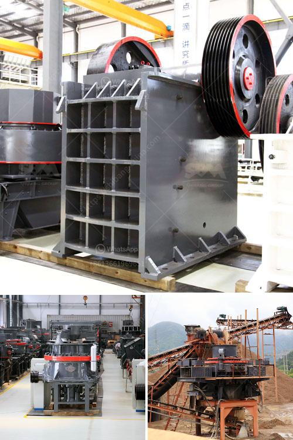

<h3>india stone crusher in bangladesh</h3>
India is one of the countries richly endowed with a variety of minerals and natural resources. The stone mining industry in India is a major player in contributing to the country's economic growth. India's stone crushers are widely used in the mining of high-quality building materials like granite and limestone.

The stone crushing industry in India has been growing rapidly due to increasing demand from the construction industry and the need for residential and commercial buildings. The stone crushers in India, primarily located in the northern and eastern regions, are responsible for producing a variety of stones of different sizes for various purposes.

Bangladesh is a rapidly developing country in South Asia with a growing economy. To meet the increasing demands for infrastructure development, stone crushers are needed to break down large stones into smaller pieces for use in construction projects. India, being a major exporter of stone crushing equipment, has been fulfilling this demand in Bangladesh.

The presence of India stone crushers in Bangladesh has multiple benefits for both countries. Firstly, it aids in providing high-quality construction materials required for building infrastructure projects. These materials are crucial for the development of roads, bridges, airports, and other essential structures.

Secondly, India stone crushers also contribute to the economic growth of Bangladesh. The import and use of stone crushing equipment from India generate revenue and create job opportunities in the stone crushing industry. This strengthens the bilateral relations between India and Bangladesh, fostering mutual cooperation and economic growth.

Furthermore, the availability of India stone crushers in Bangladesh ensures that the country does not have to solely rely on importing stone crushing equipment from other countries. This reduces costs and minimizes the dependence on foreign suppliers, ultimately leading to more sustainable and self-sufficient development.

In conclusion, the presence of India stone crushers in Bangladesh plays a critical role in meeting the country's infrastructure needs. It efficiently provides high-quality construction materials while boosting economic growth and fostering bilateral relations. The stone crushing industry in India continues to be a significant contributor to the overall development of both countries.
<h3>Contact us</h3><ul><li><strong>Whatsapp:&nbsp;<a href="https://wa.me/8613661969651">+8613661969651</a></strong></li><li><a href="https://swt.shibang-china.com/?git&amp;zhl&amp;india stone crusher in bangladesh"><strong>Online Service(chat now)</strong></a></li></ul><h3>Related</h3><ul><li><a href='washing plant suppliers in mozambique.md'>washing plant suppliers in mozambique</a></li><li><a href='hydration process of cement.md'>hydration process of cement</a></li><li><a href='quartz manufacturing process.md'>quartz manufacturing process</a></li><li><a href='process of cement.md'>process of cement</a></li><li><a href='aggregate jaw crusher price.md'>aggregate jaw crusher price</a></li></ul>