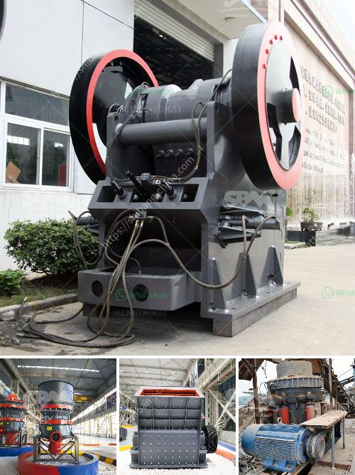

<h3>indonesia raymond mill import agent</h3>
Indonesia is one of the fastest-growing economies in Southeast Asia, and its manufacturing sector plays a significant role in the country's economic development. With the increasing demand for various industrial products, the need for efficient grinding equipment has also risen. Raymond mill, a grinding mill widely used in the mining industry, has attracted much attention in Indonesia due to its excellent performance and high efficiency.

As the most important mineral resource in Indonesia, the mining industry has witnessed significant growth in recent years. The extraction of various minerals, such as coal, copper, gold, and nickel, requires efficient grinding equipment to process the raw materials into fine powders. Raymond mill, with its advanced technology and reliable performance, has become a popular choice in the Indonesian mining industry.

Indonesia has abundant mineral resources, and its geographical location offers many advantages for trading activities. However, setting up an import business can be challenging due to language barriers, cultural differences, and complicated customs procedures. Therefore, having a reliable import agent is crucial for international companies looking to tap into the Indonesian market.

There are several key reasons why choosing an experienced and reputable import agent in Indonesia is essential for importing Raymond mills. Firstly, an import agent can help foreign companies navigate the complex import regulations in Indonesia. They have a deep understanding of the local laws, customs procedures, and documentation requirements, ensuring a smooth and hassle-free import process.

Secondly, having an import agent in Indonesia allows companies to establish a strong presence in the local market. These agents have extensive networks and connections in the industry and can provide valuable market insights and business opportunities. They can also assist with product distribution, marketing, and after-sales services, contributing to the success of foreign companies in Indonesia.

Lastly, an import agent can help companies save time and resources. Importing goods from another country involves various logistical processes, including transportation, warehousing, and customs clearance. With the assistance of an import agent, companies can streamline these operations, minimize delays, and reduce costs.

When choosing an import agent for importing Raymond mills to Indonesia, it is crucial to consider their experience, reputation, and track record. The import agent should have a comprehensive understanding of the Raymond mill market and possess the necessary qualifications and licenses to handle import activities. Moreover, they should have a proven track record of successful imports and a strong relationship with manufacturers and suppliers.

In conclusion, Indonesia is a thriving market for Raymond mills, and having a reliable import agent is crucial for foreign companies looking to enter the Indonesian market. With the right import agent, companies can navigate the complex import regulations, establish a strong presence in the local market, and save time and resources. As the demand for grinding equipment continues to rise, a trusted import agent can provide opportunities for business growth and success in Indonesia.
<h3>Contact us</h3><ul><li><strong>Whatsapp:&nbsp;<a href="https://wa.me/8613661969651">+8613661969651</a></strong></li><li><a href="https://swt.shibang-china.com/?git&amp;zhl&amp;indonesia raymond mill import agent"><strong>Online Service(chat now)</strong></a></li></ul><h3>Related</h3><ul><li><a href='rock crusher price.md'>rock crusher price</a></li><li><a href='distributor belt conveyor di philippines.md'>distributor belt conveyor di philippines</a></li><li><a href='chili powder grinding machinery.md'>chili powder grinding machinery</a></li><li><a href='used 34 ssi shredder united states.md'>used 34 ssi shredder united states</a></li><li><a href='fly ash crusher unit india.md'>fly ash crusher unit india</a></li></ul>