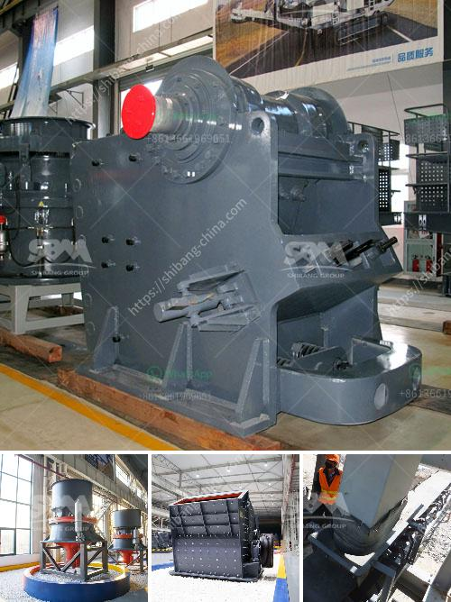

<h3>induatrial mill crusher supplier</h3>
In the ever-evolving landscape of industries, one constant factor remains - the need for efficient machinery. Whether it’s grinding, pulverizing, or crushing, a reliable industrial mill crusher supplier is crucial to ensure smooth operations and enhanced productivity. These suppliers play a pivotal role in meeting the growing demands of various sectors, from mining and construction to pharmaceutical and chemical industries.

An industrial mill crusher supplier specializes in providing robust, high-quality crushers that are specifically designed to withstand the rigors of heavy-duty applications. With their expertise and cutting-edge technologies, they offer a wide range of crushers tailored to meet specific needs, ensuring optimal performance and longevity.

One of the key factors that sets apart a reputable industrial mill crusher supplier is their commitment to understanding customers' requirements. They work closely with customers to analyze their unique needs, processing requirements, and production goals. This collaborative approach enables them to recommend the most suitable crusher for specific applications. Whether it's a jaw crusher, cone crusher, or impact crusher, these suppliers have a comprehensive range of options to choose from.

When it comes to industrial mill crushers, durability and reliability are paramount. This is where a trusted supplier's expertise comes into play. They employ advanced technologies and cutting-edge manufacturing processes to produce crushers that can handle even the toughest materials. These crushers are built to withstand heavy loads and harsh environments, minimizing downtime and ensuring maximum uptime.

Safety is another critical aspect that a reputable industrial mill crusher supplier prioritizes. They strictly adhere to local and international safety standards, incorporating key safety features into their crushers. From ensuring proper guarding to implementing emergency stop buttons and advanced dust suppression systems, they take every precaution to safeguard the well-being of operators and the surrounding environment.

In addition to providing high-quality crushers, a reliable supplier also offers comprehensive after-sales support. This includes timely maintenance and repair services, spare parts availability, and technical assistance whenever required. They understand the importance of minimizing downtime and strive to address any customer concerns promptly.

In recent years, the demand for industrial mill crushers has witnessed substantial growth, driven by increased infrastructure development and the mining industry's expansion. As a result, the market has become more competitive and demanding. To stay ahead, a reputable industrial mill crusher supplier invests heavily in research and development, continually improving their products' performance, efficiency, and environmental sustainability.

With their extensive knowledge and experience, they can cater to a wide range of industries and provide crushers that meet unique requirements. From reducing large rocks to granular sizes in mining operations to pulverizing materials for the pharmaceutical industry, these crushers have applications across diverse sectors.

In conclusion, an industrial mill crusher supplier plays a pivotal role in meeting the growing demands of industries worldwide. By offering reliable, durable, and efficient crushers, they ensure enhanced productivity and long-term success for their customers. With their expertise, cutting-edge technologies, and customer-centric approach, they are poised to thrive in the ever-evolving industrial landscape, contributing to the growth and development of various sectors.
<h3>Contact us</h3><ul><li><strong>Whatsapp:&nbsp;<a href="https://wa.me/8613661969651">+8613661969651</a></strong></li><li><a href="https://swt.shibang-china.com/?git&amp;zhl&amp;induatrial mill crusher supplier"><strong>Online Service(chat now)</strong></a></li></ul><h3>Related</h3><ul><li><a href='sample quotation letter for sand and stone.md'>sample quotation letter for sand and stone</a></li><li><a href='used sand screen in south africa sale.md'>used sand screen in south africa sale</a></li><li><a href='distributor belt conveyor di philippines.md'>distributor belt conveyor di philippines</a></li><li><a href='portable ballast crusher for sale.md'>portable ballast crusher for sale</a></li><li><a href='crushing plant aggregates in south africa.md'>crushing plant aggregates in south africa</a></li></ul>