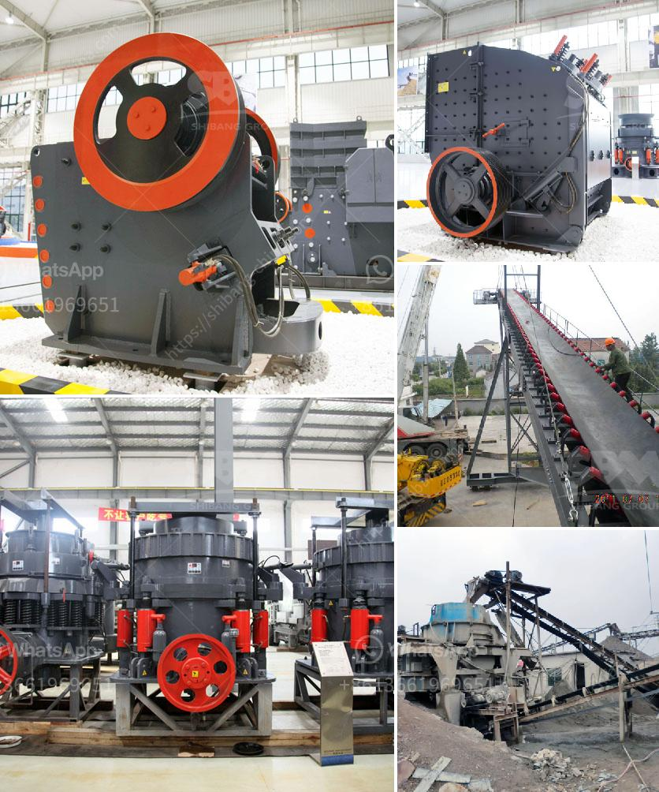

<h3>industrial ball mill price and dimensions</h3>
The ball mill plays a vital role in the process of grinding materials into fine powder. It is widely used in various industries such as mining, cement, chemistry, metallurgy and ceramics. It is ideal choice for crushing and grinding materials, which features large processing capacity, high efficiency, low energy consumption, and little pollution.

One of the key factors that determine the price of the ball mill is its specifications. A ball mill with a larger diameter is more expensive while a ball mill with a smaller diameter is less expensive. The diameter of the ball mill also influences its processing capacity. The larger the diameter, the higher the processing capacity. Conversely, the smaller the diameter, the lower the processing capacity. Besides, the capacity of the ball mill also affects its price. The higher the capacity, the higher the price.

Another important factor determining the price of the industrial ball mill is the materials used to manufacture it. The materials must possess good wear resistance, and toughness. The majority of ball mill liners are made of rubber, steel, or high chrome white iron. The price of the ball mill is also influenced by the materials used to manufacture it. The price of steel ball mill is higher than ordinary ball mill, but the investment brings the benefit of lower running costs.

The dimensions of the ball mill also play a significant role in its price. Specific dimensions can be found on the manufacturer’s website or by contacting their customer service. Typical dimensions for an industrial ball mill include the length and diameter. The length is typically regarded as the overall length of the mill barrel and essentially determines the residence time for grinding materials. The diameter, on the other hand, determines the volume of the mill and thus its capacity.

When considering the dimensions, it is important to take into account the size of the industrial space available for installation. The ball mill should fit comfortably within the designated area without hindering other processes or disrupting workflow. A proper understanding of the dimensions will help determine if the ball mill meets the requirements of the specific industrial application it would be used for.

In conclusion, the price and dimensions of an industrial ball mill depend on various factors. These factors include the specifications, materials used, and the dimensions of the mill. It is crucial to assess these factors before making a purchasing decision in order to find a ball mill that is suitable for the specific industrial application, budget, and space available for installation. Investing in the right ball mill can ensure increased productivity, reduced costs, and improved efficiency in various industries.
<h3>Contact us</h3><ul><li><strong>Whatsapp:&nbsp;<a href="https://wa.me/8613661969651">+8613661969651</a></strong></li><li><a href="https://swt.shibang-china.com/?git&amp;zhl&amp;industrial ball mill price and dimensions"><strong>Online Service(chat now)</strong></a></li></ul><h3>Related</h3><ul><li><a href='lime morter grinding machine price list.md'>lime morter grinding machine price list</a></li><li><a href='sand quarry plant.md'>sand quarry plant</a></li><li><a href='price ball mill 40tph.md'>price ball mill 40tph</a></li><li><a href='vertical ball mills of india.md'>vertical ball mills of india</a></li><li><a href='ultra conveyor belts usa.md'>ultra conveyor belts usa</a></li></ul>