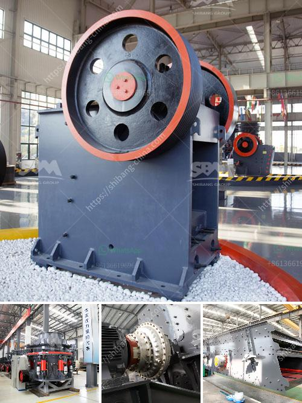

<h3>industrial gypsum rotary kiln</h3>
Industrial gypsum rotary kiln, also known as gypsum calcining kiln or gypsum calcination kiln, is mainly used for calcining gypsum at high temperature (more than 800°C). The rotary kiln produced by our company has strong structure, stable operation, high-quality products and a complete range of specifications, which can meet the production requirements of various gypsum products.

The gypsum rotary kiln is composed of cylinder, supporting device, support device with catch wheel, transmission device, movable kiln head, kiln end sealing device, coal injection pipe device and other components. The kiln body of the rotary kiln is made of high-quality carbon steel or alloy steel plate and welded, and the supporting wheel, catch wheel and gears are made of casting steel with strict quality control. The transmission system of the rotary kiln adopts two driving methods: single drive and double drive. The kiln end sealing device adopts advanced technology, which can effectively prevent the dust and gas leakage, thus ensuring the environmental protection and energy-saving operation of the rotary kiln system.

The gypsum calcining kiln is mainly used for the calcination of gypsum powder, which has wide application in the fields of building materials, construction, chemical industry and so on. With the rapid development of the gypsum industry, the demand for gypsum products has increased, and the traditional vertical kiln can no longer meet the production needs. The industrial gypsum rotary kiln has become the preferred equipment for large-scale production of gypsum.

Compared with the traditional vertical kiln, the industrial gypsum rotary kiln has the following advantages:

1. High thermal efficiency: The gypsum rotary kiln adopts the process of preheating and calcining dehydrated gypsum, which can fully utilize the waste heat from the kiln to achieve energy saving and high efficiency.

2. Automatic control system: The industrial gypsum rotary kiln is equipped with advanced control system, which can realize automatic control of the kiln temperature, pressure, air volume and other parameters, and ensure the stable operation of the kiln.

3. Wide range of applications: The industrial gypsum rotary kiln can calcine various gypsum products, such as gypsum board, gypsum powder, gypsum block, etc., and can also be used for calcining other materials with similar properties.

4. High product quality: The gypsum calcination kiln has strict quality control for each production process, and the calcined gypsum has uniform particle size, high purity and good whiteness, which can meet the requirements of various gypsum products.

In summary, the industrial gypsum rotary kiln is an important equipment in the gypsum calcination process. It has the advantages of high thermal efficiency, automatic control, wide application range and high product quality. With the continuous development of the gypsum industry, the application of gypsum rotary kiln will be more extensive, and it will make great contributions to the production of gypsum products.
<h3>Contact us</h3><ul><li><strong>Whatsapp:&nbsp;<a href="https://wa.me/8613661969651">+8613661969651</a></strong></li><li><a href="https://swt.shibang-china.com/?git&amp;zhl&amp;industrial gypsum rotary kiln"><strong>Online Service(chat now)</strong></a></li></ul><h3>Related</h3><ul><li><a href='how to start stone crusher project.md'>how to start stone crusher project</a></li><li><a href='labaratory ball mill for minerals.md'>labaratory ball mill for minerals</a></li><li><a href='between cone and horizontal impact crusher.md'>between cone and horizontal impact crusher</a></li><li><a href='how to improve grinding efficiency of a mill.md'>how to improve grinding efficiency of a mill</a></li><li><a href='cost of a silica crusher.md'>cost of a silica crusher</a></li></ul>