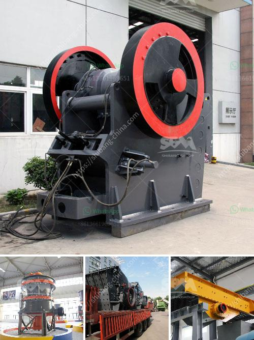

<h3>industrial hammer mill</h3>
An industrial hammer mill is a powerful machine used to shred large materials into small particles. It is highly efficient and produces consistent results, making it the preferred choice for many industrial sectors such as recycling, manufacturing, and chemical production.

The main components of an industrial hammer mill include a rotor, feed chute, and discharge screen. The rotor is driven by an electric motor or diesel engine, which rotates at high speed to generate the necessary impact and crushing force. The feed chute allows materials to enter the grinding chamber, where they are subjected to multiple high-speed impacts from the rotor.

The size and shape of the hammers, as well as the speed at which they rotate, determine the final particle size. The discharge screen acts as a classifier, allowing finer particles to pass through while larger particles are returned to the grinding chamber for further processing.

Industrial hammer mills are widely used for processing a variety of materials, including wood, biomass, waste, rubber, grains, and chemicals. They are known for their versatility and can be used for both coarse and fine grinding. Additionally, they can handle both dry and wet materials, making them suitable for a wide range of applications.

Benefits of using an industrial hammer mill include increased production capacity, reduced downtime, and improved product quality. The high-speed impact of the hammers ensures efficient and rapid material reduction, resulting in a higher throughput. The robust construction of these machines also makes them highly durable and resistant to wear and tear.

Moreover, industrial hammer mills offer excellent particle size control, producing consistent and uniform particles. This is essential in industries where particle size plays a crucial role in product quality, such as in the manufacturing of pharmaceuticals or chemicals.

In conclusion, an industrial hammer mill is a powerful and versatile machine that is widely used in various industries. Its ability to shred and grind large materials into small particles makes it an essential tool for many applications. Whether it is recycling, manufacturing, or chemical production, the industrial hammer mill can efficiently process a wide range of materials, improving productivity and product quality.
<h3>Contact us</h3><ul><li><strong>Whatsapp:&nbsp;<a href="https://wa.me/8613661969651">+8613661969651</a></strong></li><li><a href="https://swt.shibang-china.com/?git&amp;zhl&amp;industrial hammer mill"><strong>Online Service(chat now)</strong></a></li></ul><h3>Related</h3><ul><li><a href='mobile stone crusher in saudi.md'>mobile stone crusher in saudi</a></li><li><a href='coal grinding mill in bhopal india.md'>coal grinding mill in bhopal india</a></li><li><a href='quartz powder plant nigeria.md'>quartz powder plant nigeria</a></li><li><a href='activated carbon plant business plan.md'>activated carbon plant business plan</a></li><li><a href='mobile impact crusher in road construction.md'>mobile impact crusher in road construction</a></li></ul>