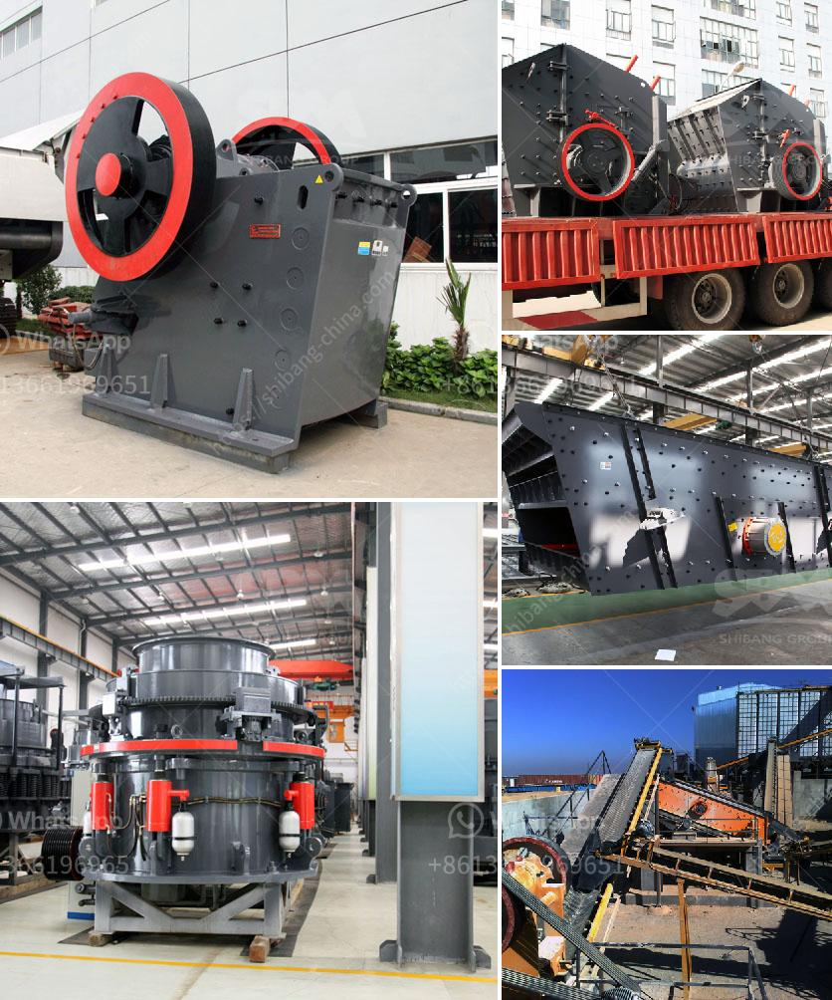

<h3>industrial mills for coal</h3>
Coal has been a fundamental energy source for centuries, powering industries and heating homes around the world. While alternative energy sources are gaining popularity, coal still plays a significant role in the global energy mix. To meet the growing demand for coal, industrial mills are essential, providing efficient and reliable coal grinding solutions to power plants, cement kilns, and other industries.

Industrial mills for coal, often referred to as coal pulverizers or coal mills, are mechanical devices that grind and classify coal into fine particles for burning in boilers or furnaces. These mills form a crucial part of a coal-fired power plant, where coal is pulverized and burned to generate steam, which in turn drives turbines to produce electricity.

One of the primary functions of an industrial mill is to crush coal into a fine powder. This is achieved through a series of grinding and impact processes. Coal is fed into the mill through a central inlet pipe and falls onto a rotating table. As the table rotates, the coal is ground between the table and rollers, breaking it down into smaller particles. The ground coal is then swept upward by the high-speed airflow, passing through a classifier that separates the fine particles from the coarser ones.

Efficiency is a crucial factor in coal grinding, as it directly impacts the overall energy consumption and operational costs of power plants. Industrial mills for coal are designed to maximize grinding efficiency and minimize energy consumption. Advanced grinding technologies, such as vertical roller mills (VRMs) and ball mills, are commonly used to achieve high grinding efficiency.

VRMs have gained prominence in recent years due to their ability to grind coal with higher efficiency compared to traditional ball mills. In a VRM, coal is crushed between a rotating grinding table and a set of grinding rollers. The grinding table reduces the material to a fine powder, and the rollers exert high pressure on the coal to facilitate grinding. This pressurized grinding results in a higher grinding efficiency and a more uniform particle size distribution.

Ball mills, on the other hand, use steel balls as grinding media to crush the coal. The coal is fed into the mill through a hollow trunnion at one end and exits through a discharge grate at the other end. As the mill rotates, the balls cascade and crush the coal into a fine powder. Ball mills offer flexibility in coal grinding due to their ability to handle varying coal qualities and moisture levels.

Apart from power generation, industrial mills for coal find applications in the cement industry, where they are used to grind coal before it is burned in the kiln. Coal grinding in cement plants offers several benefits, including the optimization of the combustion process and the ability to use low-quality coal or biomass as fuel.

In conclusion, industrial mills for coal play an indispensable role in energy production and other industrial sectors that rely on coal as a fuel source. These mills are designed to efficiently grind coal to a fine powder, enabling its combustion in boilers or furnaces. With advancements in grinding technologies, such as VRMs and ball mills, coal grinding has become more efficient, maximizing energy utilization and reducing operational costs. As energy demands continue to rise, industrial mills for coal will remain the backbone of coal-fired power plants and industries that rely on coal as a primary source of energy.
<h3>Contact us</h3><ul><li><strong>Whatsapp:&nbsp;<a href="https://wa.me/8613661969651">+8613661969651</a></strong></li><li><a href="https://swt.shibang-china.com/?git&amp;zhl&amp;industrial mills for coal"><strong>Online Service(chat now)</strong></a></li></ul><h3>Related</h3><ul><li><a href='gold mining equipment manufacturer.md'>gold mining equipment manufacturer</a></li><li><a href='business plan small scale gold mining.md'>business plan small scale gold mining</a></li><li><a href='mobile and modular coal washing plants.md'>mobile and modular coal washing plants</a></li><li><a href='cost of limestone powder crushing machine.md'>cost of limestone powder crushing machine</a></li><li><a href='list of stone crushers in odisha.md'>list of stone crushers in odisha</a></li></ul>