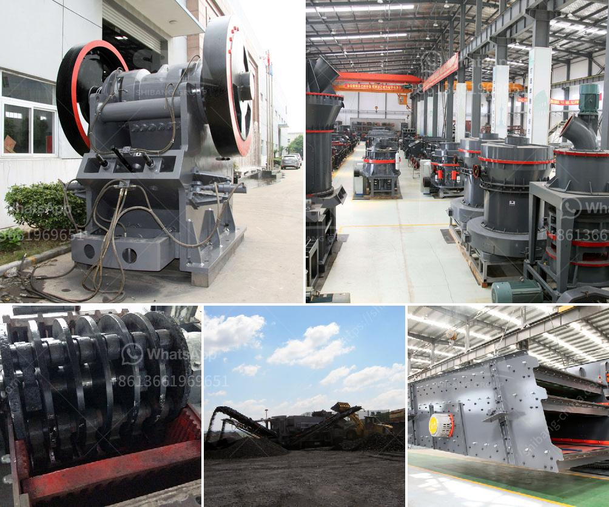

<h3>industrial vibrator feeder</h3>
Industrial vibrator feeders are essential equipment commonly used in the manufacturing and processing industries. They are designed to efficiently transport and feed bulk materials from one process to another, ensuring a smooth and uninterrupted production line. In this article, we will explore the features, benefits, and applications of industrial vibrator feeders.

Industrial vibrator feeders are devices that use vibration to move and transport materials. They consist of a vibrating drive and a trough, which is typically made of a durable material like stainless steel or mild steel. The vibrating drive consists of an electric motor with an eccentric weight attached to its rotating shaft. When the motor rotates, the eccentric weight causes the feeder to vibrate, moving the material along the trough.

One of the main advantages of using industrial vibrator feeders is their ability to handle a wide range of materials. They are capable of feeding bulk materials with varying sizes, shapes, and properties. From fine powders to large chunks of material, vibrator feeders can handle it all. The design of the trough can be customized to suit the specific requirements of the material being transported, further enhancing its versatility.

Another benefit of industrial vibrator feeders is their high feeding efficiency. The continuous vibration ensures that the material flows smoothly and evenly through the feeder, without any blockages or clogs. This not only improves productivity but also reduces downtime and maintenance costs. The consistent and regulated flow of materials also minimizes the risk of spills or accidents, ensuring a safe working environment.

Industrial vibrator feeders find applications across diverse industries. In the food and beverage industry, they are used to feed ingredients into mixers, conveyor belts, and packaging machines. In the pharmaceutical industry, they ensure the precise feeding of powders into tablet presses or encapsulating machines. They are also used in the mining and construction sectors to transport and convey bulky materials like aggregates, coal, and ores.

In addition to their functional benefits, industrial vibrator feeders offer several economic advantages. They are energy-efficient, requiring less power to operate compared to other feeding mechanisms. The design simplicity of vibrator feeders also results in lower maintenance and servicing costs. Moreover, their long lifespan ensures a high return on investment for businesses.

However, it is important to choose a reliable supplier or manufacturer for industrial vibrator feeders. They must adhere to industry standards and provide the necessary support and expertise for proper installation, maintenance, and troubleshooting. Additionally, it is crucial to conduct thorough material analysis and testing to ensure compatibility with the feeder and prevent any potential issues.

In conclusion, industrial vibrator feeders have become indispensable equipment in various industries. Their ability to efficiently and reliably transport bulk materials makes them an essential component of many manufacturing and processing operations. With their versatility, high feeding efficiency, and economic advantages, industrial vibrator feeders contribute to improved productivity, reduced downtime, and cost savings.
<h3>Contact us</h3><ul><li><strong>Whatsapp:&nbsp;<a href="https://wa.me/8613661969651">+8613661969651</a></strong></li><li><a href="https://swt.shibang-china.com/?git&amp;zhl&amp;industrial vibrator feeder"><strong>Online Service(chat now)</strong></a></li></ul><h3>Related</h3><ul><li><a href='calcium carbonate grinding ball mill.md'>calcium carbonate grinding ball mill</a></li><li><a href='product of crushing plant.md'>product of crushing plant</a></li><li><a href='stone mill grinder price.md'>stone mill grinder price</a></li><li><a href='used stone crushers from japan for sale.md'>used stone crushers from japan for sale</a></li><li><a href='stone crusher portable.md'>stone crusher portable</a></li></ul>