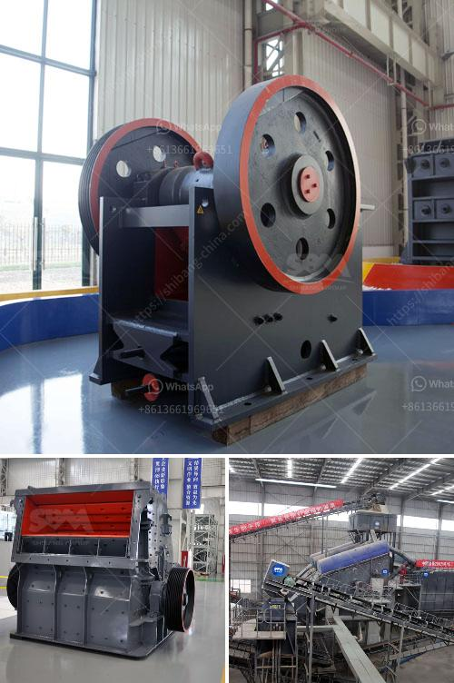

<h3>iron ore beneficiation poland</h3>
Iron ore beneficiation in Poland is a crucial part of the mining process that enables economic growth and sustainability for the country. Iron ore is a valuable raw material that is extracted from iron deposits and has been used in construction, transportation, and various other industries for centuries.

Iron ore deposits in Poland occur in two main regions: the Sudetes and the Kujawy- Pomorze area. The Sudetes region, located near the border with the Czech Republic and Germany, has been the source of iron ore mining for centuries. The Kujawy-Pomorze region in central Poland has recently become a significant player in the iron ore industry.

The beneficiation of iron ore involves the process of crushing, screening, grinding, washing, and separating the iron ore concentrate from the waste materials such as gravel, sand, and clay. The key beneficiation process typically includes dense media separation (DMS), jigging, hydrocyclone separation, spiral concentration, magnetic separation, and flotation.

One of the main challenges in iron ore beneficiation is the presence of impurities and undesired components that reduce the iron content of the mined ore. Impurities such as silica, alumina, and phosphorus must be reduced to create a high-quality iron ore concentrate suitable for steel production. This is typically achieved through a combination of physical and chemical beneficiation methods.

Poland's iron ore beneficiation plants have been developed to meet the country's increasing demand for a high-quality iron ore concentrate. The beneficiation methods used in the processing of iron ores vary depending on the ore source and end-use requirements.

Poland's iron ore reserves and resources are in both hematite and magnetite ores. The country has a significant amount of iron ore resources, estimated at over 8.5 billion tonnes, which makes it one of the largest iron ore producers in Europe.

Iron ore mining in Poland is conducted by both open-pit and underground mining methods. The extracted iron ore is then crushed and ground before concentrating by various techniques such as wet and dry magnetic separation, flotation, and gravity separation.

Poland's iron ore beneficiation is focused on supplying steel complexes with high-quality raw materials. Additionally, Poland is one of Europe's largest consumers of raw materials for steel production. Consequently, the beneficiation of iron ore plays a significant role in Poland's economy.

The iron ore beneficiation industry in Poland can be traced back to the operating hematite mines in Lubin, Swietochlowice, and Wronki, which used to provide the Polish steel mills with concentration for steel production. However, since the closure of these mines, Poland has become increasingly reliant on imported iron ore, which highlights the importance of enhancing domestic beneficiation capacity.

In conclusion, iron ore beneficiation in Poland is a thriving industry that contributes to the country's economic growth and sustainability. The beneficiation process aims to remove impurities and increase the iron content of the mined ore to create high-quality concentrates suitable for steel production. Poland's extensive iron ore resources and reserves provide a solid foundation for the beneficiation industry, making it an essential component of the country's economic development.
<h3>Contact us</h3><ul><li><strong>Whatsapp:&nbsp;<a href="https://wa.me/8613661969651">+8613661969651</a></strong></li><li><a href="https://swt.shibang-china.com/?git&amp;zhl&amp;iron ore beneficiation poland"><strong>Online Service(chat now)</strong></a></li></ul><h3>Related</h3><ul><li><a href='chinese gypsum production line equipment.md'>chinese gypsum production line equipment</a></li><li><a href='stone crusher plant project feasibility study.md'>stone crusher plant project feasibility study</a></li><li><a href='rock crushing machine speed limit.md'>rock crushing machine speed limit</a></li><li><a href='quarry stone business plan pdf.md'>quarry stone business plan pdf</a></li><li><a href='for sale used mobile jaw crusher australia.md'>for sale used mobile jaw crusher australia</a></li></ul>