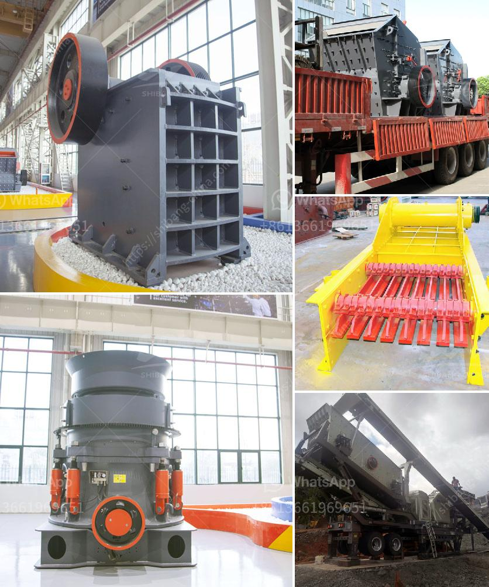

<h3>iron ore beneficiation technology</h3>
Iron ore beneficiation technology refers to the process of extracting iron ore from its natural state and converting it into a concentrate that is beneficiated with iron content. In modern industrial civilization, iron ore is vital for virtually any type of manufacturing industry, including construction, transportation, machinery, energy, and automotive.

There are several methods of iron ore beneficiation. The most prominent ones are magnetic separation, flotation, and gravity separation. Each method utilizes different techniques to separate and concentrate the iron content.

Magnetic separation is a common beneficiation method that uses magnetic differences between minerals to separate valuable minerals from gangue minerals. The process involves passing a magnetic field through a mixture of finely ground ore and water. The magnetic particles adhere to the magnetic poles, while non-magnetic particles flow out as tailings. This technique is especially effective for low-grade iron ores, as it can separate iron ore particles from silica and other impurities.

Flotation is another widely used iron ore beneficiation technology. It utilizes the differences in physicochemical properties of minerals to separate valuable minerals from gangue minerals. In this process, finely ground ore is mixed with water and chemicals, such as collectors and frothers. Air bubbles are then introduced into the mixture, causing the valuable minerals to attach to the bubbles and rise to the surface as a froth. The froth is then collected, while the remaining gangue minerals settle at the bottom as tailings.

Gravity separation is a beneficiation method that relies on the density differences between minerals to separate them. It is commonly used for coarse-grained iron ores. The process involves feeding the ore particles onto a shaking table or a spiraling device, which generates a centrifugal force that separates the heavy, valuable minerals from the lighter gangue minerals. The heavy minerals are collected at the bottom of the table or spiral while the lighter materials flow out as tailings.

In addition to these primary iron ore beneficiation methods, there are also various auxiliary equipment and technologies that can be used to refine and upgrade iron ore. These include magnetic roasting, calcination, acid leaching, and bioleaching.

Magnetic roasting involves heating the ore in the presence of a reducing agent to convert magnetic iron minerals into magnetic compounds that can be easily separated from non-magnetic gangue minerals. Calcination is the process of heating the iron ore to remove volatile and harmful impurities, such as sulfur and carbon. Acid leaching involves using acids to dissolve undesired impurities, while bioleaching utilizes microorganisms to extract iron from low-grade ores.

Iron ore beneficiation technology has played a vital role in the modern iron ore mining industry and economic development. However, with the increasing depletion of high-grade iron ore resources, the utilization of low-grade iron ores has gained more attention. Innovative technologies are being developed to extract iron from these low-grade ores more efficiently and economically. Continuous advancements in iron ore beneficiation technology are essential to ensure a sustainable supply of iron ore for future generations.
<h3>Contact us</h3><ul><li><strong>Whatsapp:&nbsp;<a href="https://wa.me/8613661969651">+8613661969651</a></strong></li><li><a href="https://swt.shibang-china.com/?git&amp;zhl&amp;iron ore beneficiation technology"><strong>Online Service(chat now)</strong></a></li></ul><h3>Related</h3><ul><li><a href='industrial mills for coal.md'>industrial mills for coal</a></li><li><a href='tanzania small stone crusher sale.md'>tanzania small stone crusher sale</a></li><li><a href='granite edge cutting machine in sweden.md'>granite edge cutting machine in sweden</a></li><li><a href='how to start a stone crushing business in nigeria.md'>how to start a stone crushing business in nigeria</a></li><li><a href='crusher price in malaysia stones.md'>crusher price in malaysia stones</a></li></ul>