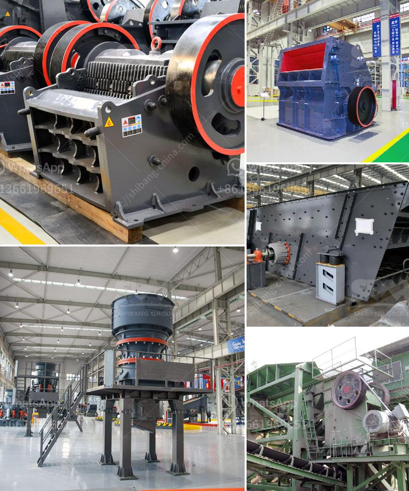

<h3>iron ore crushing equipment in mexico</h3>
Iron ore refers to the minerals and rocks from which metallic iron is extracted. Mexico has an abundance of iron ore deposits that can be found in various regions throughout the country. The iron ore mining industry in Mexico has become an integral and important part of the country's economy. Over the years, it has been transformed from a small-scale industry with limited production to a highly mechanized and advanced industry.

To extract iron from its ores, various crushing equipment are required. The most commonly used iron ore crushing equipment includes jaw crusher, cone crusher, hammer crusher, ball mill, ultrafine grinding mill, etc. These equipment can also be divided into flowchart, belt conveyor, vibrating screen, vibrating feeder, etc.

Iron ore crushing equipment in Mexico generally adopts mechanized ore crushing technology, mainly consisting of hydraulic cone crusher, belt conveyor, vibrating feeder, and circular vibrating screen. In addition, the production line may also be equipped with other auxiliary equipment such as dust removal equipment. This equipment helps reduce the dust produced during the crushing process, making the work environment more favorable for the operators and avoiding potential health hazards.

The primary crushing process of iron ore involves a single crushing stage, generally using a jaw crusher as the primary crusher. The jaw crusher is a reliable and high-efficiency crushing equipment that can easily break down the iron ore into small pieces. The crushed iron ore is then transported by belt conveyor to the secondary crushers for further crushing.

The secondary crushing process uses a cone crusher or an impact crusher, depending on the application requirements. After the secondary crushing, the iron ore is screened through a vibrating screen and classified according to the desired size. The oversized material is sent back to the cone crusher or impact crusher for re-crushing, while the properly sized material is sent to the stockpile.

In conclusion, the iron ore crushing equipment in Mexico plays an important role in the mining process and the economy. With the advancement of technology and the increase in demand for iron ore, the equipment will continue to evolve and improve to meet the needs of the industry. Mexico's rich iron ore resources will undoubtedly attract more investors and contribute to the growth of the country's economy.
<h3>Contact us</h3><ul><li><strong>Whatsapp:&nbsp;<a href="https://wa.me/8613661969651">+8613661969651</a></strong></li><li><a href="https://swt.shibang-china.com/?git&amp;zhl&amp;iron ore crushing equipment in mexico"><strong>Online Service(chat now)</strong></a></li></ul><h3>Related</h3><ul><li><a href='coal grinding mill in bhopal india.md'>coal grinding mill in bhopal india</a></li><li><a href='vibro feeder price listing south africa.md'>vibro feeder price listing south africa</a></li><li><a href='used 500 tph stone crusher prices.md'>used 500 tph stone crusher prices</a></li><li><a href='coal crushing and screening plant for sale south africa.md'>coal crushing and screening plant for sale south africa</a></li><li><a href='cost analysis of stone quarry in india.md'>cost analysis of stone quarry in india</a></li></ul>