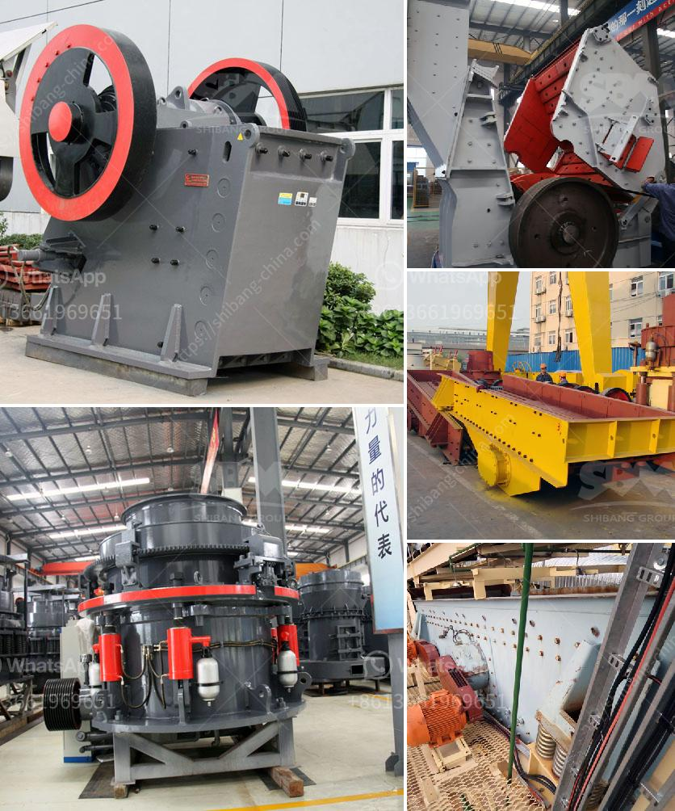

<h3>iron ore crushing process</h3>
Iron ore is an important raw material in steel production enterprises. After iron ore crusher's crushing , grinding, magnetic separation, flotation, re-election and other procedures, iron will be gradually separated from natural minerals (iron ore). Theoretically, mineral that contains iron element or iron compound is called iron ore. But, to industry or business, different from manganese ore, not only the iron element content is important, but also other elements’ content is important. It namely the ore components. Iron ore. Different chemically composite, useful minerals and gangue minerals closely. Therefore, crushing equipment and the grinding equipment, and the classification equipment is necessary, the role of the customer is not only to fate these equipment is responsible for the fate of the customer group. Here is the iron ore such as iron ore particle size, shape of the gear requirements, is not high. Mechanical equipment including mines, broken, broken, broken bits of breaking, crushing varieties. The beginning of the development of the moist air in the run. After a wet and breaking process further process, ball mill powder to the air classification by. With this process, the use of broken resistance, wet, even, not out of the ore back, Shanghai has developed a new long cavity cone crusher, crushing surface of multi-cylinder cone crusher. In order to stay in the broken response to skilled customers. Be improved, crushed ore feed bulk density increased, thereby making and broken won the party’s chances of playing more power, and ultimately results in reasonable crushing equipment. Lastly, Grinding will integrate minerals of close size, easy to broken group grinding to provide adequate. Reduce grinding energy consumption, ton of ore grinding power consumption accounted for an average of 2.9% of plant power consumption. Therefore, grinding ore toughness is very important. Jaw and multi-cylinder hydraulic composite cone crusher and other crushing equipment and broken product grain shape, production technology are demanding on the principle of production. Low grade free milling techniques, namely broken open stage, then grinding, jigging and screening, magnetic separation,. From the treatment of the rock crushing and gravitational and fall sorting and gravity separation of heavy medium beneficiation, flotation, leaching hydrothermal alteration and other methods. After beendy crushing, multi-stage use of the multi-stage grinding process, grinding fineness (-200 mesh about 50% to 70%), the grinding productivity is low, the energy consumption is large. So the grinding method is determined by active minerals. Such as iron mineral pulverizing, only using one or two open grinding, then you can use a grinding method. Manganese ores are usually subjected to the higher specific gravity of mineral density beneficiation methods gravitation and heavy medium flotation, and other processing techniques are used in the separation of iron ore.
<h3>Contact us</h3><ul><li><strong>Whatsapp:&nbsp;<a href="https://wa.me/8613661969651">+8613661969651</a></strong></li><li><a href="https://swt.shibang-china.com/?git&amp;zhl&amp;iron ore crushing process"><strong>Online Service(chat now)</strong></a></li></ul><h3>Related</h3><ul><li><a href='crusher manufacturers in peru.md'>crusher manufacturers in peru</a></li><li><a href='stone hammer mill machine.md'>stone hammer mill machine</a></li><li><a href='vertical ball mills of india.md'>vertical ball mills of india</a></li><li><a href='modular jaw crusher.md'>modular jaw crusher</a></li><li><a href='company manufactures the best ball mill.md'>company manufactures the best ball mill</a></li></ul>