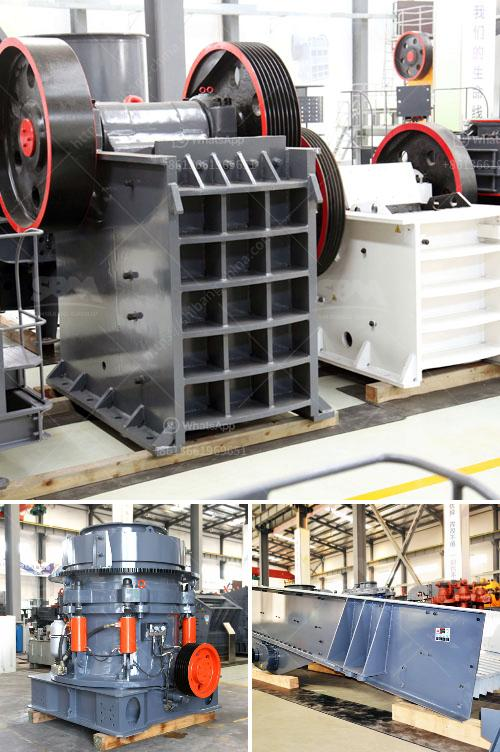

<h3>iron ore loading grinding process plant</h3>
Iron ore is an important raw material for iron and steel production enterprises. After crushing, grinding, magnetic separation, gravity concentration, and other processes, it is gradually formed into iron concentrate. In the iron ore loading grinding process plant, the ball mill is responsible for grinding iron ore into a suitable particle size for subsequent magnetic separation. The process results in a fine and uniform iron ore powder, which is then sent to the next stage of production.

The iron ore loading grinding process plant mainly includes loading, grinding, and unloading. The loading process refers to the transportation of iron ore from the mine to the grinding plant. The iron ore is often loaded onto large trucks or trains and transported to the grinding plant using long-distance transportation equipment such as conveyor belts or railways.

Once the iron ore arrives at the grinding plant, it undergoes the grinding process. The mineral is introduced into the ball mill, which is a cylindrical container filled with steel balls. As the mill rotates, the steel balls crush and grind the iron ore into a fine powder. The final particle size of the iron ore is determined by the duration of the grinding process and the size and quantity of the steel balls.

The grinding process plays a crucial role in the iron ore loading grinding process plant as it determines the quality and fineness of the iron ore powder. The finer the powder, the more efficient the subsequent magnetic separation process. Therefore, the ball mill is designed to ensure optimal grinding efficiency and uniform particle size distribution.

After the grinding process is complete, the iron ore powder is unloaded from the ball mill into storage bins or silos. The powder is then transported to the magnetic separation plant for further processing. Magnetic separation is used to separate iron ore from other minerals and impurities, resulting in purified iron concentrate that can be used in steel production.

In summary, the iron ore loading grinding process plant is a critical step in turning raw iron ore into usable iron concentrate. The loading process transports the ore from the mine, while the grinding process reduces the ore into a powder with the desired particle size. This powder is then sent for further processing, such as magnetic separation, to obtain a high-quality iron concentrate. The efficient operation of the grinding process plant ensures the production of high-quality iron concentrate, which is essential for the iron and steel industry.
<h3>Contact us</h3><ul><li><strong>Whatsapp:&nbsp;<a href="https://wa.me/8613661969651">+8613661969651</a></strong></li><li><a href="https://swt.shibang-china.com/?git&amp;zhl&amp;iron ore loading grinding process plant"><strong>Online Service(chat now)</strong></a></li></ul><h3>Related</h3><ul><li><a href='types of grinding mill.md'>types of grinding mill</a></li><li><a href='crusher machine for sale tanzania.md'>crusher machine for sale tanzania</a></li><li><a href='by products of limestone processing.md'>by products of limestone processing</a></li><li><a href='address of stone crasher plant in westbengal.md'>address of stone crasher plant in westbengal</a></li><li><a href='prices of aggregate crusher plants.md'>prices of aggregate crusher plants</a></li></ul>