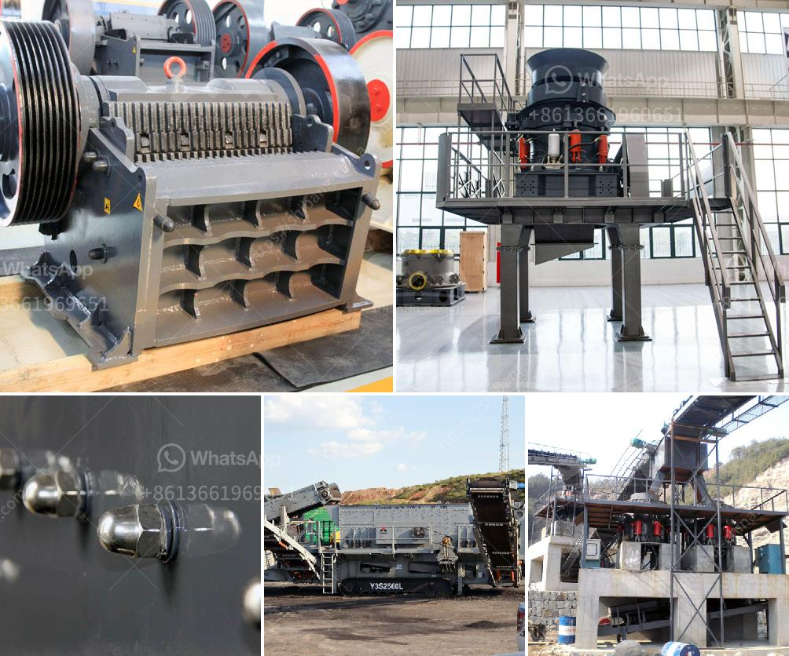

<h3>iron ore melting plant supplier china</h3>
Iron ore is an essential raw material in the production of steel, and China is one of the world's largest consumers and producers of iron ore. To meet the growing demand for steel, China heavily relies on iron ore imports. Iron ore melting plants are crucial in the process of converting iron ore into usable steel products. These plants require high-quality equipment and machinery to ensure efficient and reliable operations.

China has been the leading supplier of iron ore melting plants for several reasons. Firstly, the country possesses vast reserves of iron ore, making it an ideal supplier for both domestic and international markets. China's rich iron ore deposits ensure a stable supply of raw materials for its melting plants.

Secondly, Chinese suppliers have gained global recognition for their expertise in designing and manufacturing iron ore melting plant equipment. These suppliers offer a wide range of solutions, including crushers, ball mills, kilns, and various other machinery required in the iron ore melting process. The quality and durability of their equipment have made them popular choices among steel manufacturers worldwide.

In addition, China benefits from its advanced technology in the iron ore melting industry. Chinese suppliers constantly invest in research and development to improve the efficiency and environmental sustainability of their equipment. This allows them to meet stringent international standards and regulations, making their products highly sought after.

Furthermore, China's competitive pricing has made it an attractive option for iron ore melting plants. By leveraging economies of scale and efficient production processes, Chinese suppliers can offer cost-effective solutions without compromising on quality. This has contributed to China's dominance in the global iron ore melting plant supply market.

In conclusion, China's position as a leading supplier of iron ore melting plants is built on its vast reserves of iron ore, expertise in equipment manufacturing, advanced technology, and competitive pricing. As the demand for steel continues to rise, China remains a reliable source for iron ore melting plant equipment, supporting the growth of the steel industry worldwide.
<h3>Contact us</h3><ul><li><strong>Whatsapp:&nbsp;<a href="https://wa.me/8613661969651">+8613661969651</a></strong></li><li><a href="https://swt.shibang-china.com/?git&amp;zhl&amp;iron ore melting plant supplier china"><strong>Online Service(chat now)</strong></a></li></ul><h3>Related</h3><ul><li><a href='clay crusher machine in india.md'>clay crusher machine in india</a></li><li><a href='stone crusher second hand south africa.md'>stone crusher second hand south africa</a></li><li><a href='gyratory crusher copper mine.md'>gyratory crusher copper mine</a></li><li><a href='jaw crusher used india.md'>jaw crusher used india</a></li><li><a href='crushers and feeders in south africa.md'>crushers and feeders in south africa</a></li></ul>