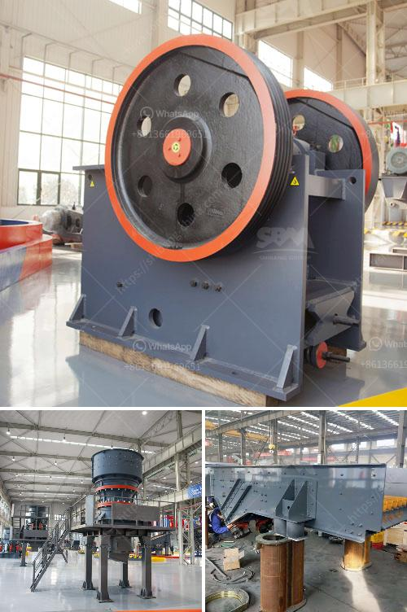

<h3>iron ore pelletisation plant china</h3>
Iron ore pelletisation, or in other words, creation of iron ore pellets, has traditionally been an essential step in the iron ore production process. Chinese steel production relies heavily on imported iron ore, predominantly sourced from Australia and Brazil. However, in recent years, China has been investing in projects to increase its domestic iron ore pellet production capacity.

One such project is the establishment of iron ore pelletisation plants in China. These plants aim to transform raw iron ore into high-quality pellets that can be used in blast furnaces to produce steel. By converting iron ore into pellets, the steel production process becomes more efficient and environmentally friendly.

China's iron ore pelletisation plants often employ the grate-kiln process, a highly efficient and sustainable technique. This process involves mixing the iron ore concentrate with additives and binding agents in a balling drum, where the mixture forms green pellets. These green pellets are then transferred to a traveling grate, where they are dried, preheated, and sintered. Finally, the pellets are cooled and screened before being transported to steel production facilities.

The construction of iron ore pelletisation plants in China has several advantages. Firstly, it reduces the country's reliance on imported iron ore, ensuring a more stable supply and reducing costs. Secondly, it contributes to the development of the domestic iron ore industry, creating employment opportunities and fostering economic growth. Moreover, the use of domestically produced pellets can help mitigate the environmental impacts associated with long-distance transportation of iron ore.

Furthermore, iron ore pelletisation plants in China play a vital role in supporting the country's steel industry, which is the largest in the world. As demand for steel continues to rise, the production of high-quality pellets becomes crucial to meet the growing requirements of the steel market.

In conclusion, iron ore pelletisation plants in China hold immense significance in the country's pursuit of a sustainable and self-sufficient steel industry. By enhancing the efficiency and environmental sustainability of the steel production process, these plants contribute to China's economic development while reducing its dependence on imported iron ore.
<h3>Contact us</h3><ul><li><strong>Whatsapp:&nbsp;<a href="https://wa.me/8613661969651">+8613661969651</a></strong></li><li><a href="https://swt.shibang-china.com/?git&amp;zhl&amp;iron ore pelletisation plant china"><strong>Online Service(chat now)</strong></a></li></ul><h3>Related</h3><ul><li><a href='price stone crusher dragon.md'>price stone crusher dragon</a></li><li><a href='crushers manufacturers in south africa.md'>crushers manufacturers in south africa</a></li><li><a href='induatrial mill crusher supplier.md'>induatrial mill crusher supplier</a></li><li><a href='gold hammer mills in harare zimbabwe.md'>gold hammer mills in harare zimbabwe</a></li><li><a href='stone crushers price in south.md'>stone crushers price in south</a></li></ul>