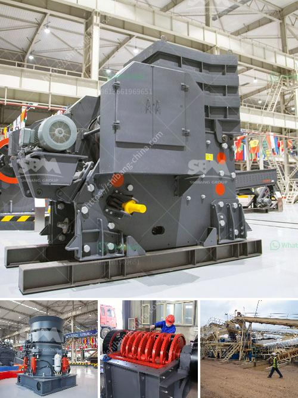

<h3>iron processing equipment in mexico</h3>
Mexico is a country known for its rich mineral resources and has become one of the largest producers of iron and steel in Latin America. To keep up with the demands of the ever-growing manufacturing industry, iron processing equipment has played a crucial role in Mexico's production capacity and economic growth.

Iron processing equipment refers to a range of machinery used in various stages of the iron ore mining and processing process. These machines are designed to extract, refine, and process iron ore into usable products such as iron pellets or steel. Some examples of iron processing equipment commonly used in Mexico include crushers, vibrating screens, grinding mills, magnetic separators, and flotation machines.

One of the primary steps in iron processing involves crushing the iron ore into smaller particles. Crushers are used for this purpose, where large pieces of iron ore are broken down into smaller ones, making it easier for the subsequent processes. Vibrating screens are then utilized to separate out the different-sized particles and ensure that only ore of the correct size enters the next stage.

After crushing and screening, iron ore often goes through a grinding process to further reduce its size. This is where grinding mills come into play, which use rotating cylinders and steel balls to grind the ore into fine powder. The finer the particles, the more efficient subsequent processes like magnetic separation and flotation will be.

Magnetic separators are important iron processing equipment used to separate magnetic materials from non-magnetic ones. By applying a magnetic field, these machines attract and separate magnetic particles from the rest of the ore. This process significantly enhances the purity of the final iron product.

Flotation machines are commonly used to separate valuable minerals from the gangue or waste materials. By introducing air bubbles into the slurry, these machines make the valuable minerals attach to the bubbles and rise to the surface, while the gangue settles down. This process is widely used in iron ore processing to separate iron-bearing minerals from impurities, leading to higher-quality iron products.

The availability and efficiency of iron processing equipment in Mexico have been crucial in meeting the growing demands of the manufacturing industry. These machines not only streamline the iron ore processing but also contribute to the production of high-quality iron products, strengthening Mexico's position in the global market.

Additionally, the presence of advanced iron processing equipment has also led to job creation and economic growth in Mexico. As the industry grows, more skilled workers are needed to operate, maintain, and develop these machines, creating employment opportunities and attracting investments.

In conclusion, iron processing equipment has become the backbone of Mexico's manufacturing industry. The efficient extraction, refining, and processing of iron ore have enabled the country to meet the demands of the global market while contributing to economic growth. With continued advancements in technology, the iron processing industry in Mexico is expected to further thrive and solidify its position as a leading producer in the region.
<h3>Contact us</h3><ul><li><strong>Whatsapp:&nbsp;<a href="https://wa.me/8613661969651">+8613661969651</a></strong></li><li><a href="https://swt.shibang-china.com/?git&amp;zhl&amp;iron processing equipment in mexico"><strong>Online Service(chat now)</strong></a></li></ul><h3>Related</h3><ul><li><a href='stone crusher conveyors belt price.md'>stone crusher conveyors belt price</a></li><li><a href='list of mini cement plants in gujarat.md'>list of mini cement plants in gujarat</a></li><li><a href='100 per ton coal crush and screen plant.md'>100 per ton coal crush and screen plant</a></li><li><a href='marble grinding factory in dubai.md'>marble grinding factory in dubai</a></li><li><a href='how much cost to buildton cement plant.md'>how much cost to buildton cement plant</a></li></ul>