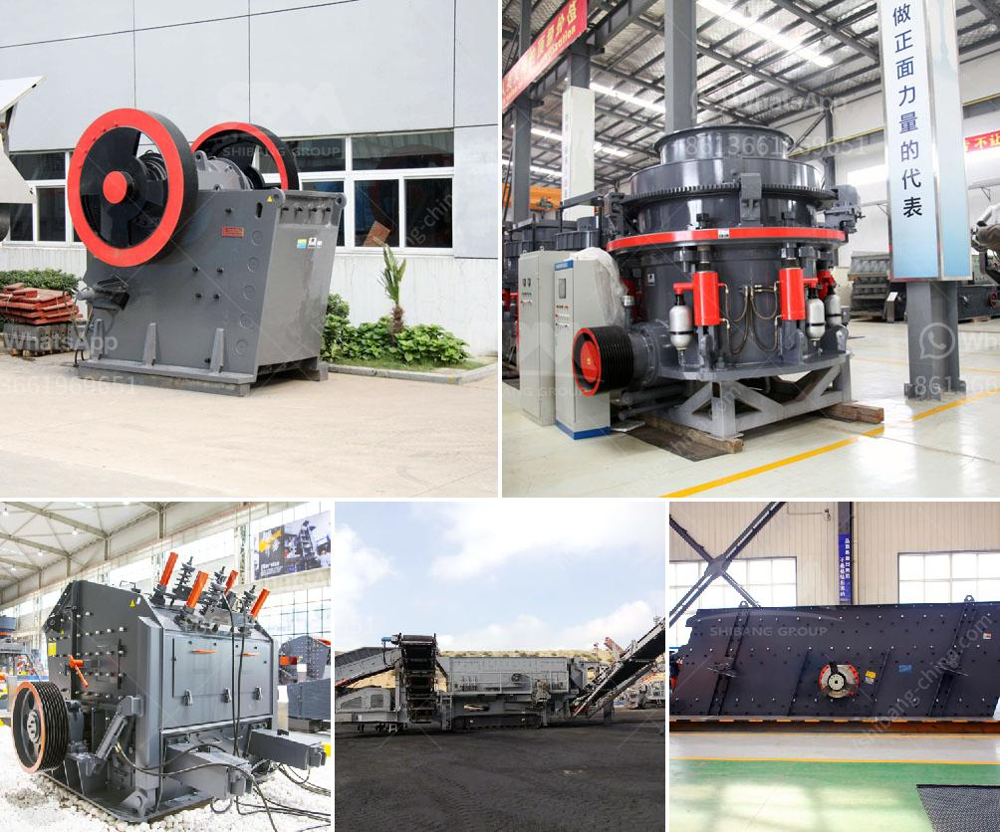

<h3>jaw crusher 150 ton pricing</h3>
In the mining and aggregate industries, countless operations rely on jaw crushers for their primary crushing needs. As the demand for crushed stone, sand, and gravel continues to increase, it is essential for businesses to find cost-effective solutions that can handle these materials efficiently. One such solution is the jaw crusher.

A jaw crusher is a versatile machine that is commonly used for crushing stone or rock. It is mounted on tracks, allowing it to move around the job site easily. As its name suggests, the jaw crusher uses a jaw-like mechanism to crush materials. The rock is placed between two jaws and is crushed into smaller pieces as pressure is applied.

When purchasing a jaw crusher, pricing is a significant factor to consider. The cost can vary depending on the size and capabilities of the machine. For instance, a 150 ton jaw crusher might seem quite expensive compared to a smaller model. However, its higher price is justified by its ability to process large amounts of material efficiently.

The jaws of a 150 ton jaw crusher can crush up to 1,000 tons of material per hour, greatly reducing the need for manual labor. This makes it a cost-effective solution for companies dealing with high volumes of material. Furthermore, the durability and reliability of a jaw crusher ensure that it will continue to function optimally even under heavy usage.

In addition to its efficiency and productivity, a jaw crusher offers various benefits that make it an attractive option for the aggregate industry. Its simplicity of design allows for ease of operation and maintenance. It can also handle a wide range of materials, from soft limestone to hard granite, making it a versatile tool for various applications.

In conclusion, a jaw crusher plays a crucial role in the mining and aggregate industries by breaking down large rocks into smaller, more manageable pieces. The pricing of a 150 ton jaw crusher may seem higher initially, but its efficiency and productivity make it a cost-effective solution in the long run. Whether it is used for primary crushing or secondary crushing, a jaw crusher transforms the aggregate industry by improving efficiency, reducing manual labor, and offering versatility in material processing.
<h3>Contact us</h3><ul><li><strong>Whatsapp:&nbsp;<a href="https://wa.me/8613661969651">+8613661969651</a></strong></li><li><a href="https://swt.shibang-china.com/?git&amp;zhl&amp;jaw crusher 150 ton pricing"><strong>Online Service(chat now)</strong></a></li></ul><h3>Related</h3><ul><li><a href='mobile crushers manufactureres in china.md'>mobile crushers manufactureres in china</a></li><li><a href='conveyor belts in mexico.md'>conveyor belts in mexico</a></li><li><a href='gypsum board making machine supplier.md'>gypsum board making machine supplier</a></li><li><a href='ball mill for ceramic tile factory.md'>ball mill for ceramic tile factory</a></li><li><a href='how to make a stone crusher mining.md'>how to make a stone crusher mining</a></li></ul>