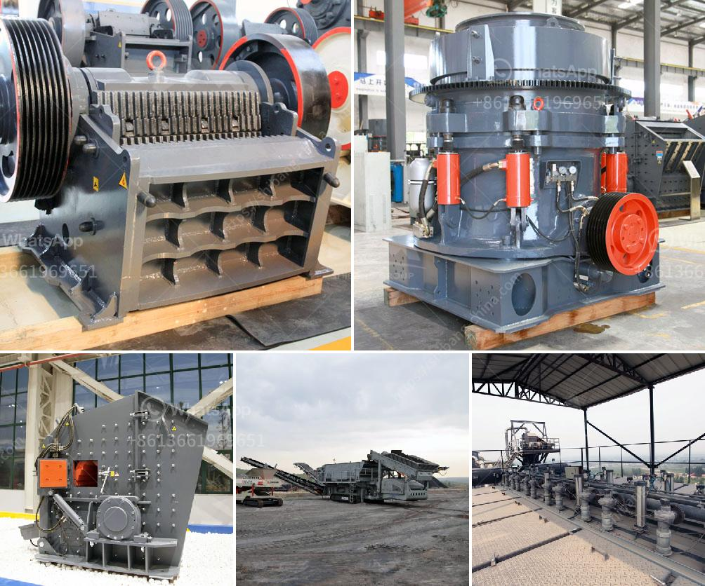

<h3>jaw crusher and spare parts</h3>
The jaw crusher is a machine that has the ability to break various types of building materials like rocks into smaller pieces. As a result, larger rocks can be reduced into smaller rocks that can be used for gravel and various other construction purposes. Jaw crushers are widely used in the mining industry because of their ability to consistently satisfy the needs of customers. The latest jaw crushers available in the market today have been designed with various advanced features that ensure they deliver the finest and accurate output needed by customers.

One of the most important components of a jaw crusher is the jaw plate, which is also known as a tooth plate. The jaw plates are generally made of manganese steel (an extremely hard metal). Manganese steel is known for its exceptional wear resistance, which ensures that the jaw plates can withstand harsh conditions without wearing out easily. The jaw plates are separated into two main categories: the fixed jaw plate and the movable jaw plate. The fixed jaw plate is fixed onto the frame of the jaw crusher, while the movable jaw plate moves in an eccentric motion and is used to crush the rocks.

Apart from the jaw plates, other crucial spare parts for a jaw crusher include the toggle plates, flywheel, eccentric shaft, bearings, spring, brackets, and the tension rods. These parts are necessary for the smooth operation of the jaw crusher and enhance its performance. For instance, the toggle plates act as a safety mechanism for the jaw crusher by preventing the overload of the crusher. They also cushion the jaw movement during the crushing process to avoid excessive wear on the jaw plates. The flywheel is responsible for storing energy that is used by the jaw crusher during the crushing process.

Just like any machine, jaw crushers are prone to wear and tear. This is where spare parts come in handy. Manufacturers offer a wide range of spare parts for jaw crushers, including different sizes and shapes of jaw plates, flywheels, cheek plates, toggle plates, and many more. These spare parts are durable and designed to fit perfectly with the jaw crusher. Therefore, if any of the parts in the jaw crusher are damaged or worn out, it can easily be replaced with the appropriate spare part to ensure smooth functioning of the machine.

To conclude, jaw crushers are widely used in the mining industry for their ability to break down rocks into smaller pieces. The jaw crusher consists of various parts including the jaw plates, toggle plates, flywheel, and many more. These spare parts play a crucial role in the smooth functioning and optimal performance of the jaw crusher. Therefore, it is essential to regularly maintain the jaw crusher and replace any worn-out or damaged spare parts to prolong its lifespan and improve its efficiency in processing rocks.
<h3>Contact us</h3><ul><li><strong>Whatsapp:&nbsp;<a href="https://wa.me/8613661969651">+8613661969651</a></strong></li><li><a href="https://swt.shibang-china.com/?git&amp;zhl&amp;jaw crusher and spare parts"><strong>Online Service(chat now)</strong></a></li></ul><h3>Related</h3><ul><li><a href='used sand making machine dealers.md'>used sand making machine dealers</a></li><li><a href='malaysia mobile cone crusher price.md'>malaysia mobile cone crusher price</a></li><li><a href='starting of ball mill with vfd.md'>starting of ball mill with vfd</a></li><li><a href='used screens crushers for coal uk.md'>used screens crushers for coal uk</a></li><li><a href='cone crusher 100tph prices in india.md'>cone crusher 100tph prices in india</a></li></ul>