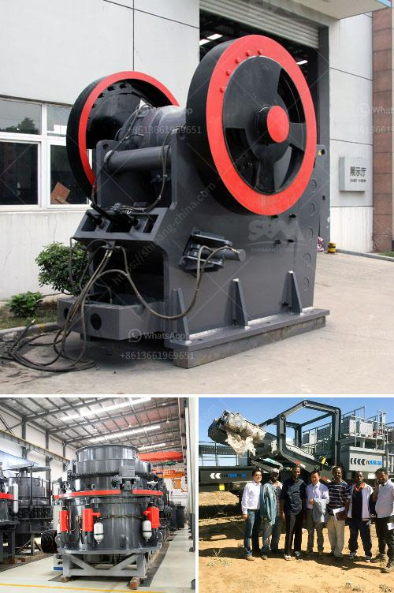

<h3>jaw crusher equipment supplier</h3>
The jaw crusher is one of the most commonly used primary crushing equipment in mining and quarrying industries. Its ruggedness and versatility have made it the preferred choice for various applications, such as aggregates production, mining operations, and recycling.

However, choosing the right jaw crusher supplier can be a daunting task, especially if you are new to the mining and quarrying industry. With so many suppliers and manufacturers available, it is crucial to consider several factors before making a final decision.

Firstly, you need to assess the quality of the jaw crushers provided by the supplier. A high-quality jaw crusher should be able to withstand extreme conditions while delivering reliable performance. Look for suppliers that use premium materials and advanced manufacturing processes to ensure durability and longevity. It is also advisable to request product samples or visit the supplier's manufacturing facility to assess the quality firsthand.

Secondly, consider the supplier's reputation in the industry. A reputable supplier is more likely to provide reliable products and excellent customer service. Look for reviews and testimonials from previous customers to gauge the supplier's reputation. Additionally, consider if the supplier has won any industry awards or certifications, as these indicate a commitment to quality.

The range of jaw crushers offered by the supplier is another crucial factor to consider. Different applications require different types of jaw crushers, such as single-toggle and double-toggle designs. Ensure that the supplier offers a diverse range of models to cater to your specific needs. Furthermore, inquire about customization options, as some suppliers can tailor the jaw crushers to meet your unique requirements.

In addition to the product itself, it is important to assess the supplier's after-sales service and support. A reliable supplier should offer timely technical assistance, spare parts availability, and maintenance services. Having a supplier that can address any issues or concerns promptly can minimize downtime and keep your operations running smoothly.

Another important consideration is the supplier's pricing and delivery terms. While cost is a crucial factor, it should not be the sole determining factor. Instead, focus on getting the best value for your investment by considering the supplier's overall offering, including product quality, after-sales service, and support. Request quotes from multiple suppliers and compare them to find the most competitive pricing without compromising on quality.

Lastly, consider the supplier's location and logistics capabilities. Opting for a supplier geographically closer to your site can result in faster shipping times and lower transportation costs. Additionally, inquire about the supplier's ability to handle international shipments, if applicable, to ensure smooth delivery regardless of your location.

Selecting the right jaw crusher equipment supplier is essential for maximizing productivity and minimizing downtime in your operations. By considering factors such as quality, reputation, range of products, after-sales service, pricing, and logistics capabilities, you can make an informed decision that meets your specific needs. Remember to do thorough research, seek recommendations, and evaluate multiple suppliers before making a final choice.
<h3>Contact us</h3><ul><li><strong>Whatsapp:&nbsp;<a href="https://wa.me/8613661969651">+8613661969651</a></strong></li><li><a href="https://swt.shibang-china.com/?git&amp;zhl&amp;jaw crusher equipment supplier"><strong>Online Service(chat now)</strong></a></li></ul><h3>Related</h3><ul><li><a href='price of smallest chippings crusher plant.md'>price of smallest chippings crusher plant</a></li><li><a href='ballast machines for sale in kenya.md'>ballast machines for sale in kenya</a></li><li><a href='standard operating procedure of ball mill.md'>standard operating procedure of ball mill</a></li><li><a href='ton per hour stone crusher plant.md'>ton per hour stone crusher plant</a></li><li><a href='mill for grinding quartz.md'>mill for grinding quartz</a></li></ul>