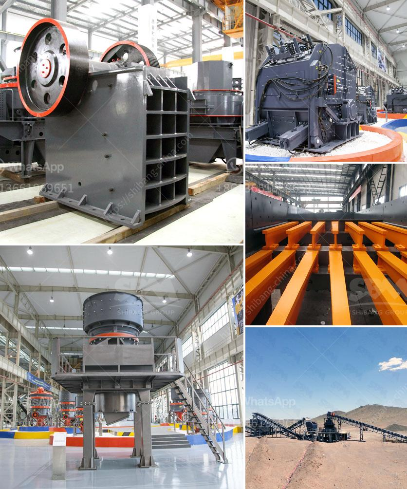

<h3>jaw crusher for rent indonesia</h3>
If you are looking for a cost-effective yet efficient solution for mining and construction needs in Indonesia, a jaw crusher for rent in Indonesia is the perfect fit. Jaw crusher offers a versatile and highly efficient solution to the industry, providing a reliable rock crusher in various applications. Jaw crushers are known for their ability to process rocks and other materials with high strength and hardness, making them suitable for a wide range of applications in mining, construction, and demolition industries.

Renting a jaw crusher can be a lucrative business venture, especially for contractors seeking to maximize their profits and reduce expenses. With a wide range of rental options available in Indonesia, businesses can easily find a jaw crusher that meets their specific needs and budget. Renting a jaw crusher not only eliminates the cost of purchasing a new machine but also reduces transportation and maintenance costs.

In addition to low costs, renting a jaw crusher in Indonesia offers other benefits such as flexibility and ease of use. Rental options allow businesses to freely choose the duration and location of usage, providing greater flexibility in project planning. Furthermore, rental services often include trained operators who can set up and operate the machine, eliminating the need for additional training and reducing downtime.

Moreover, jaw crushers are designed to be user-friendly, ensuring easy operation and maintenance. Regular maintenance and inspections are key to maximizing the lifespan and performance of the equipment. By renting a jaw crusher, businesses can avoid the hassle of maintenance and repairs, as most rental providers include routine maintenance services in their packages.

In conclusion, renting a jaw crusher in Indonesia can be a cost-effective and efficient solution for construction and mining enterprises. Offering a wide range of rental options, highly efficient equipment, and professional maintenance services, jaw crusher rental providers in Indonesia will help maximize your profitability and reduce expenses. Renting a jaw crusher is the perfect solution for businesses that want to focus on their core operations while outsourcing their rock crushing needs.
<h3>Contact us</h3><ul><li><strong>Whatsapp:&nbsp;<a href="https://wa.me/8613661969651">+8613661969651</a></strong></li><li><a href="https://swt.shibang-china.com/?git&amp;zhl&amp;jaw crusher for rent indonesia"><strong>Online Service(chat now)</strong></a></li></ul><h3>Related</h3><ul><li><a href='impact crusher saudi arabia.md'>impact crusher saudi arabia</a></li><li><a href='raymond grinding mill for sale in thailand.md'>raymond grinding mill for sale in thailand</a></li><li><a href='impact crusher specification limestone.md'>impact crusher specification limestone</a></li><li><a href='price of stone crusher plant.md'>price of stone crusher plant</a></li><li><a href='crushing machine manufacturer in maharashtra.md'>crushing machine manufacturer in maharashtra</a></li></ul>