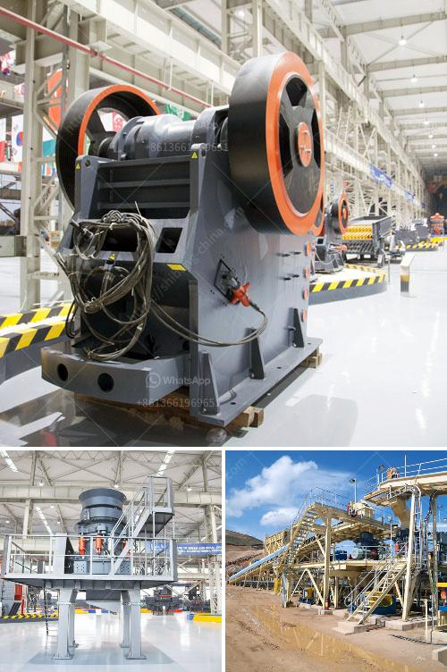

<h3>jaw crusher for sale in ethiopia</h3>
Jaw crusher for sale in Ethiopia is a versatile stone crushing machine that is used as primary or secondary crusher. It also can be called a heavy-duty jaw crusher or a universal jaw crusher. Depending on the application requirements, jaw crusher for sale in Ethiopia can be customized in different sizes, styles, and configurations.

A jaw crusher is the most commonly used primary crushing machine in Ethiopia. It is mainly used to crush different materials with compression strength less than 320 MPa. The jaw crusher for sale in Ethiopia is commonly used as a primary crusher. It is suitable for coarse crushing of various rocks and ores with a compressive strength up to 320 MPa. This jaw crusher for sale in Ethiopia is also used extensively in mining, construction, metallurgy, and chemical industries.

The jaw crusher for sale in Ethiopia is designed to crush even the hardest rock and concrete materials, including granite, basalt, quartz stone, iron ore, gold ore, marble, etc. Its working principle is simple: the jaw crusher for sale in Ethiopia uses the periodic movement of two jaws to crush the stones and ores. The materials are crushed between two jaws: the fixed jaw and the movable jaw. The fixed jaw is fixed to the front frame of the crusher, while the movable jaw is attached to the movable jaw plate. As the movable jaw moves back and forth, the stones and ores are crushed between the jaws, resulting in smaller-sized particles.

The jaw crusher for sale in Ethiopia is equipped with a double-toggle jaw crusher, which is characterized by its simple structure, reliable operation, and easy maintenance. The moving jaw and the fixed jaw adopt high-quality steel casting, ensuring the high durability and efficiency of the crusher. The jaw plates are interchangeable, allowing for easy replacement in case of wear or damage.

In addition to its primary crushing applications, the jaw crusher for sale in Ethiopia can also be used as a secondary or tertiary crusher. It can crush various types of stones and ores with different hardness levels, such as limestone, dolomite, granite, and iron ore. The jaw crusher for sale in Ethiopia is used for secondary crushing after jaw crusher, impact crusher, or cone crusher.

With the excellent performance and low maintenance cost, the jaw crusher for sale in Ethiopia is also very popular among customers worldwide. It is widely used in quarrying, mining, construction, and recycling applications. The jaw crusher for sale in Ethiopia is not only suitable for crushing materials of different hardness levels but also has a wide range of applications due to its versatile functionality.

In conclusion, the jaw crusher for sale in Ethiopia is a versatile stone crushing machine that is suitable for primary, secondary, and tertiary crushing applications. It is characterized by its simple structure, reliable operation, easy maintenance, and high durability. Whether used as a primary crusher or a secondary crusher, the jaw crusher for sale in Ethiopia is sure to meet the crushing needs of various industries. With its excellent performance and low maintenance cost, it is a valuable investment for any construction or mining project in Ethiopia.
<h3>Contact us</h3><ul><li><strong>Whatsapp:&nbsp;<a href="https://wa.me/8613661969651">+8613661969651</a></strong></li><li><a href="https://swt.shibang-china.com/?git&amp;zhl&amp;jaw crusher for sale in ethiopia"><strong>Online Service(chat now)</strong></a></li></ul><h3>Related</h3><ul><li><a href='sell of used dolomite roller mill in india.md'>sell of used dolomite roller mill in india</a></li><li><a href='alluvial diamond processing plant cost.md'>alluvial diamond processing plant cost</a></li><li><a href='sell crusher conica peru.md'>sell crusher conica peru</a></li><li><a href='crusher plant equipment supplier in saudi arabia.md'>crusher plant equipment supplier in saudi arabia</a></li><li><a href='jaw crusher for rent indonesia.md'>jaw crusher for rent indonesia</a></li></ul>