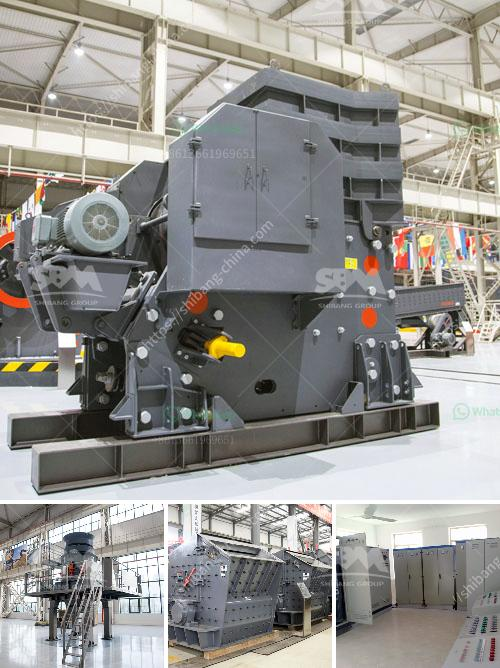

<h3>jaw crusher for sale in nigeria</h3>
In Nigeria, minerals such as talc, gypsum plaster, iron ore, lead zinc ore, bentonite, barite, gold ore, asphalt, coal, limestone, niobium, lead and zinc were discovered and soon mining and quarrying contributed significantly to the Nigerian economy. The Nigerian process industries have experienced a steady development since the late 20th century, with abundant overviews available on the nation's mineral potentials.

One of the key products that Keestrack will be presenting in Nigeria is its jaw crusher, which can be used in any type of application thanks to the list of customizations available. The Keestrack jaw crusher is not only thorough in its production capacity, but also optimized to ensure the lowest possible operating cost. As a result, these machines are built to last for a long time, and are only made from high-quality components for maximum reliability.

The jaw crusher for sale in Nigeria is designed to crush and crush various materials developed in the industries of metallurgy, mining, chemical engineering, building materials, water conservancy, ceramics and highway construction, etc. It can be divided into two types, namely, coarse crushing and fine crushing. The "Coarse Crusher" is capable of handling various materials with a compressive strength up to 350 MPa, breaking materials into coarse, secondary, and fine particles. Meanwhile, the "Fine Crusher" is suitable for secondary and tertiary crushing, with a large capacity range from 80 to 350 TPH.

With its outstanding performance and versatile applications, the jaw crusher for sale in Nigeria is widely used in mining, metallurgy, construction, and roads construction, water conservancy and chemical industries for crushing various materials with compression strength not exceeding 320 MPa. This kind of machine has been highly recognized by the market due to its excellent performance and reliable quality.

In conclusion, the jaw crusher for sale in Nigeria has a wide range of applications, and it is the most suitable equipment for primary crushing of hard rocks, such as granite, quartzite, and basalt. The jaw crusher for sale in Nigeria is ideally suited for crushing medium hard stone like limestone and all mineral-based demolition materials, such as bricks, asphalt, and concrete. With years of experience in producing jaw crusher, Keestrack has developed a wide range of machines to meet diverse crushing requirements. So whether you need to crush mineral rocks, river pebbles, construction waste or other materials, the jaw crusher for sale in Nigeria is sure to meet your specific needs.
<h3>Contact us</h3><ul><li><strong>Whatsapp:&nbsp;<a href="https://wa.me/8613661969651">+8613661969651</a></strong></li><li><a href="https://swt.shibang-china.com/?git&amp;zhl&amp;jaw crusher for sale in nigeria"><strong>Online Service(chat now)</strong></a></li></ul><h3>Related</h3><ul><li><a href='capital cost gold processing plant.md'>capital cost gold processing plant</a></li><li><a href='ball mill capacity 26 x 41.md'>ball mill capacity 26 x 41</a></li><li><a href='rock crusher plant price.md'>rock crusher plant price</a></li><li><a href='stone crusher hire south yorkshire.md'>stone crusher hire south yorkshire</a></li><li><a href='stone crusher plant manufacturers china.md'>stone crusher plant manufacturers china</a></li></ul>