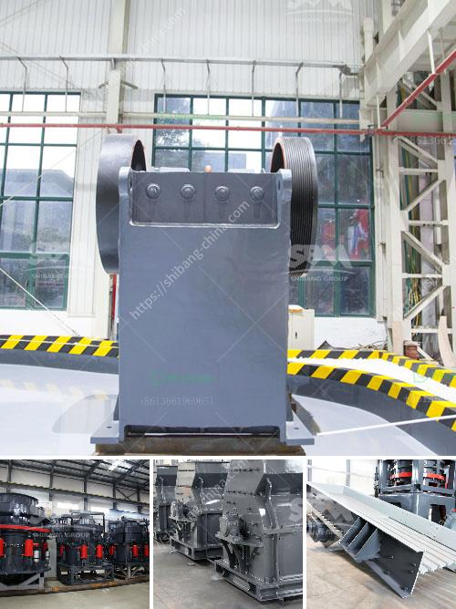

<h3>jaw crusher in dubai</h3>
Jaw crushers are robust machines that have been utilized for crushing rock and ore in industrial operations for decades. In Dubai, the construction industry has been flourishing over the years, prompting an increasing demand for these powerful machines. The jaw crusher in Dubai applications are available for various industries including mining, smelting, building materials, highway, railway, water conservancy, chemical industry and many others.

The crusher is mainly used for coarse crushing various materials for construction purposes. The innovative design of the jaw crusher makes it an efficient crushing machine, while maintaining low power consumption led to the development of environmentally-friendly equipment. The hydraulic jaw crusher is powered by electric motor, providing an easy and convenient method for maintenance.

The lubrication system ensures continuous and stable operation of the equipment. The jaw crusher in Dubai is fully equipped with hydraulic system and PLC control, ensuring reliability and ease of maintenance. The jaw crusher in Dubai is designed specifically for primary stage crushing. It is easier to install and maintain for the individuals and businesses that rely on jaw crushers for their operations.

A jaw crusher is a compression type crusher, comprised of a fixed jaw and moving jaw positioned in a (V). The movable jaw compresses material against the fixed jaw, crushing the material to the desired size. The material exits the jaw through the bottom of the crusher otherwise, known as the discharge opening. Changing the discharge opening controls the product size made by the crusher.

Jaw crushers are mainly used at the primary stage of material reduction in several applications, including rock quarries, sand and gravel, mining, construction, and demolition recycling, construction aggregates, metallurgy, and chemical industries.

In conclusion, jaw crushers are a valuable addition to any mining or industrial operation, they offer a reliable and cost-effective solution for primary crushing of rock, ore, and minerals in Dubai.
<h3>Contact us</h3><ul><li><strong>Whatsapp:&nbsp;<a href="https://wa.me/8613661969651">+8613661969651</a></strong></li><li><a href="https://swt.shibang-china.com/?git&amp;zhl&amp;jaw crusher in dubai"><strong>Online Service(chat now)</strong></a></li></ul><h3>Related</h3><ul><li><a href='mobile coal jaw crusher for hire.md'>mobile coal jaw crusher for hire</a></li><li><a href='grinding mill machine price.md'>grinding mill machine price</a></li><li><a href='crusher machine manufacturer in coimbatore.md'>crusher machine manufacturer in coimbatore</a></li><li><a href='machinery conveyor belts.md'>machinery conveyor belts</a></li><li><a href='silica sand crusher machine.md'>silica sand crusher machine</a></li></ul>