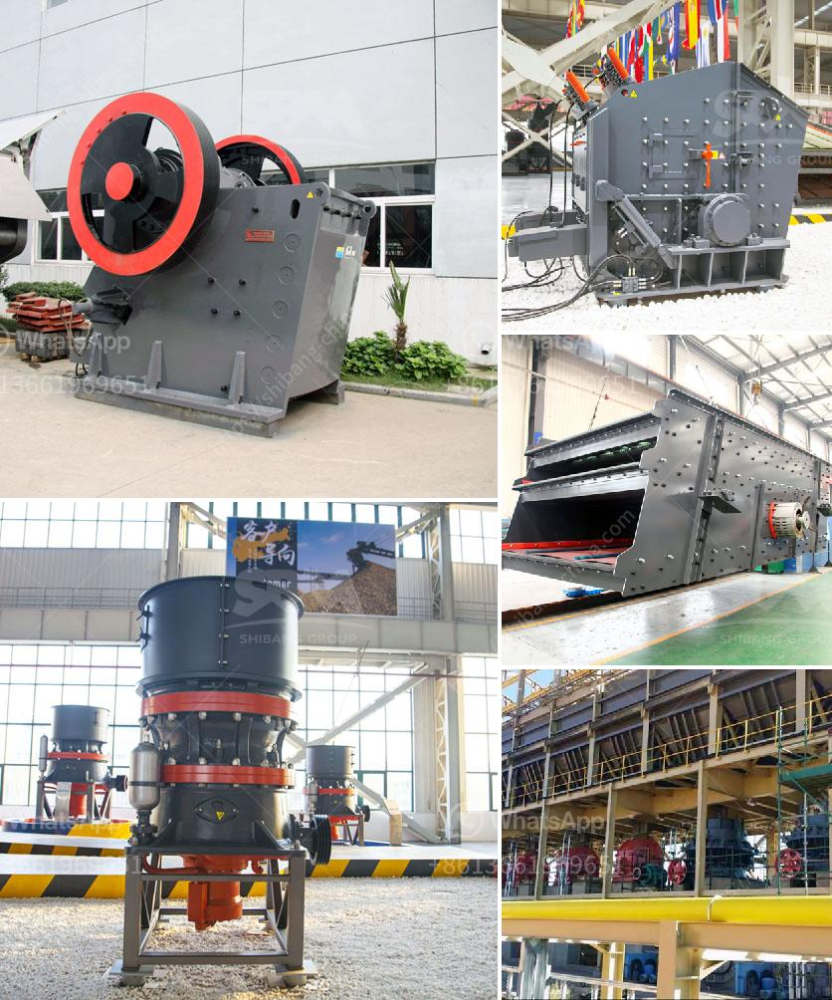

<h3>jaw crusher in german</h3>
Der Kieferbrecher, auch bekannt als Backenbrecher, ist eine Maschine, die hauptsächlich im Bergbau- und Bauwesen eingesetzt wird, um Gestein und Schutt in kleinere Stücke zu zerkleinern. Das Hauptmerkmal eines Kieferbrechers ist sein großer und kräftiger Kiefer, der das Material zwischen zwei festen Backenplatten zerdrückt.

Der Kieferbrecher besteht aus einem festen Rahmen, auf dem die beweglichen Backen montiert sind. Eine der Bewegungen ist die hin- und hergehende Bewegung der beweglichen Backe gegenüber der festen Backe. Dies erzeugt den Zerkleinerungseffekt. Die Größe des Spalts zwischen den Backen kann je nach Anforderungen und Größe des zu zerkleinernden Materials angepasst werden.

Die Vorteile eines Kieferbrechers sind vielfältig. Erstens kann er eine große Menge an Material in kurzer Zeit zerkleinern, was bei größeren Bauprojekten von Vorteil ist. Zweitens ist er in der Lage, sehr hartes Material wie Gestein zu zerkleinern, das für andere Maschinen schwierig zu bearbeiten sein könnte. Drittens ist er einfach zu bedienen und erfordert keine komplizierten Wartungsarbeiten. Darüber hinaus kann der Kieferbrecher auch mit anderen Anlagen gekoppelt werden, um einen reibungslosen Materialfluss zu gewährleisten.

Eine der Hauptanwendungen von Kieferbrechern ist der Abbau von Gestein in Steinbrüchen und Bergwerken. Durch den Einsatz eines Kieferbrechers kann das Gestein zunächst in kleinere Stücke gebrochen werden, die dann weiterverarbeitet werden können. Dies erleichtert den Abtransport des Materials und spart Zeit und Kosten.

Ein weiterer wichtiger Einsatzbereich für Kieferbrecher ist im Baugewerbe. Bei Bauvorhaben werden oft große Mengen an Schutt und Abfallmaterialien erzeugt. Der Kieferbrecher kann dazu beitragen, diese Materialien zu zerkleinern und für die weitere Verwendung vorzubereiten. Dies kann beispielsweise bedeuten, dass Betonreste zu wiederverwendbaren Materialien zerkleinert werden, was die Nachhaltigkeit und Umweltfreundlichkeit von Bauprojekten verbessert.

Der Kieferbrecher hat auch in der Recyclingindustrie eine wichtige Rolle. Indem er Materialien wie Beton, Asphalt und Ziegel zerkleinert, ermöglicht er deren Wiederverwertung. Dies ist ein wichtiger Schritt zur Reduzierung von Abfall und zur Förderung einer nachhaltigen Kreislaufwirtschaft.

Insgesamt ist der Kieferbrecher eine äußerst nützliche Maschine, sowohl für den Bergbau als auch für die Bauindustrie und das Recycling. Seine Fähigkeit, hartes Material zu zerkleinern, große Mengen in kurzer Zeit zu bewältigen und einfach zu bedienen zu sein, macht ihn zu einem unverzichtbaren Werkzeug in verschiedenen Branchen. Mit kontinuierlichen technologischen Fortschritten wird der Kieferbrecher weiterhin neue Möglichkeiten bieten und die Effizienz und Produktivität in verschiedenen Industriezweigen verbessern.
<h3>Contact us</h3><ul><li><strong>Whatsapp:&nbsp;<a href="https://wa.me/8613661969651">+8613661969651</a></strong></li><li><a href="https://swt.shibang-china.com/?git&amp;zhl&amp;jaw crusher in german"><strong>Online Service(chat now)</strong></a></li></ul><h3>Related</h3><ul><li><a href='gypsum powder grinding mill price in pakistan.md'>gypsum powder grinding mill price in pakistan</a></li><li><a href='stone crushing plant manufacturers in.md'>stone crushing plant manufacturers in</a></li><li><a href='stone crusher plants in mexico.md'>stone crusher plants in mexico</a></li><li><a href='calcium carbonate powder machine.md'>calcium carbonate powder machine</a></li><li><a href='capital cost gold processing plant.md'>capital cost gold processing plant</a></li></ul>