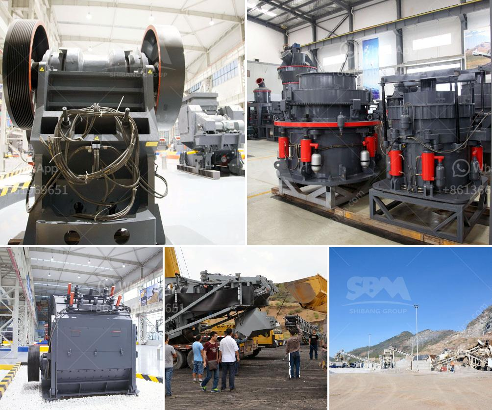

<h3>jaw crusher manufactures in saudi</h3>
Saudi Arabia is a sovereign Arab state in Western Asia constituting the bulk of the Arabian Peninsula. The country's command economy is petroleum-based but slowly diversifying; in 2020, 51% of budget revenues and 90% of export earnings came from the oil industry. As the largest exporter of petroleum and natural gas in the Middle East, Saudi Arabia plays a pivotal role in the global energy market. With such a booming economy, the construction industry has also witnessed significant growth, thereby increasing the demand for heavy machinery, including jaw crushers.

Jaw crushers are popular primary crushing machines in the mining industry due to their ability to crush a wide range of materials with varying strengths. They play a crucial role in the aggregate and construction material industries, as they are the first step in the processing of raw materials. It is, therefore, essential to have reliable and efficient jaw crusher manufacturers in Saudi Arabia.

To meet the growing demand for high-quality jaw crushers, the Kingdom has witnessed the establishment of several large-scale mining companies over the past few years. These companies have invested extensively in state-of-the-art machinery to ensure the production of high-quality aggregates for various construction projects.

One such company that has been at the forefront of jaw crusher manufacturing in Saudi Arabia is Saeed Mohammed Al Ghandi & Sons (SMAG). SMAG is a leading distributor of construction equipment and represents various global manufacturers such as Volvo, SDLG, and Sandvik. The company offers an extensive range of jaw crushers suitable for various applications and capacities. Their products are known for their reliability, durability, and excellent performance in harsh conditions.

Another prominent player in the jaw crusher manufacturing industry in Saudi Arabia is Radayef Crusher. Radayef Crusher is the leading supplier of all types of crusher materials in the Eastern Province of Saudi Arabia and offers a variety of top-quality aggregate products for construction, building, and development projects. The company's products adhere to international standards and are produced using the latest technologies to ensure the best quality and performance.

Furthermore, Al-Ajmi Company has been operating in the construction industry for over three decades and has become a major player in the jaw crusher manufacturing industry in Saudi Arabia. Al-Ajmi Company utilizes modern technology and machinery to produce high-grade aggregate materials for concrete, asphalt, and base course projects. The company focuses on customer satisfaction and continuously aims to exceed their expectations by providing top-quality products and services.

In conclusion, the demand for jaw crushers in Saudi Arabia is on the rise, and several prominent manufacturers are competing to meet this demand. These manufacturers have invested greatly in the latest technologies and state-of-the-art machinery to ensure the highest quality of jaw crushers for their clients. With such a competitive market, customers can expect to find a wide range of jaw crushers suitable for various applications and requirements.
<h3>Contact us</h3><ul><li><strong>Whatsapp:&nbsp;<a href="https://wa.me/8613661969651">+8613661969651</a></strong></li><li><a href="https://swt.shibang-china.com/?git&amp;zhl&amp;jaw crusher manufactures in saudi"><strong>Online Service(chat now)</strong></a></li></ul><h3>Related</h3><ul><li><a href='sewa mobile stone crusher di indonesia.md'>sewa mobile stone crusher di indonesia</a></li><li><a href='starting of ball mill with vfd.md'>starting of ball mill with vfd</a></li><li><a href='ball mill capacity 26 x 41.md'>ball mill capacity 26 x 41</a></li><li><a href='dolomite crushing machine pdf.md'>dolomite crushing machine pdf</a></li><li><a href='companies that manufacture ball mill.md'>companies that manufacture ball mill</a></li></ul>